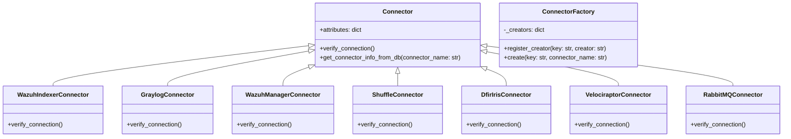
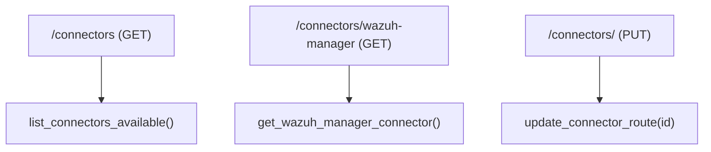
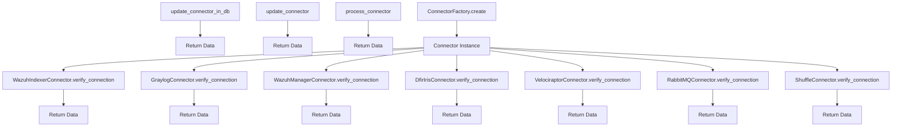

# DB Modals

```mermaid
classDiagram
    class ConnectorsAvailable {
        +int id
        +str connector_name
        +str connector_description
        +str connector_supports
        +bool connector_configured
        +bool connector_verified
    }

    class Connectors {
        +int id
        +str connector_name
        +str connector_type
        +str connector_url
        +DateTime connector_last_updated
        +str connector_username
        +str connector_password
        +str connector_api_key
    }

    class DisabledRules {
        +int id
        +str rule_id
        +str previous_level
        +str new_level
        +str reason_for_disabling
        +DateTime date_disabled
        +int length_of_time
    }

    class WazuhIndexerAllocation {
        +int id
        +str node
        +float disk_used
        +float disk_available
        +float disk_total
        +float disk_percent
        +DateTime timestamp
    }

    class GraylogMetricsAllocation {
        +int id
        +float input_usage
        +float output_usage
        +float processor_usage
        +float input_1_sec_rate
        +float output_1_sec_rate
        +float total_input
        +float total_output
        +DateTime timestamp
    }

    class AgentMetadata {
        +int id
        +str agent_id
        +str ip_address
        +str os
        +str hostname
        +bool critical_asset
        +DateTime last_seen
    }

    class Case {
        +int id
        +int case_id
        +str case_name
        +str agents
    }

    class Artifact {
        +int id
        +str artifact_name
        +JSONB artifact_results
        +str hostname
    }
```

# Connector Classes

```mermaid
classDiagram
    class Connector {
        +attributes: dict
        +verify_connection()
        +get_connector_info_from_db(connector_name: str)
    }

    class WazuhIndexerConnector {
        +verify_connection()
    }
    Connector <|-- WazuhIndexerConnector

    class GraylogConnector {
        +verify_connection()
    }
    Connector <|-- GraylogConnector

    class WazuhManagerConnector {
        +verify_connection()
    }
    Connector <|-- WazuhManagerConnector

    class ShuffleConnector {
        +verify_connection()
    }
    Connector <|-- ShuffleConnector

    class DfirIrisConnector {
        +verify_connection()
    }
    Connector <|-- DfirIrisConnector

    class VelociraptorConnector {
        +verify_connection()
    }
    Connector <|-- VelociraptorConnector

    class RabbitMQConnector {
        +verify_connection()
    }
    Connector <|-- RabbitMQConnector

    class ConnectorFactory {
        -_creators: dict
        +register_creator(key: str, creator: str)
        +create(key: str, connector_name: str)
    }
```

# Routes

```mermaid
graph TD;
  A["/connectors (GET)"] --> B["list_connectors_available()"]
  C["/connectors/wazuh-manager (GET)"] --> D["get_wazuh_manager_connector()"]
  E["/connectors/<id> (PUT)"] --> F["update_connector_route(id)"]
```

# Responses

```mermaid
graph TD;
    A[update_connector_in_db] --> B[Return Data]
    C[update_connector] --> D[Return Data]
    E[process_connector] --> F[Return Data]
    G[ConnectorFactory.create] --> H[Connector Instance]
    H --> I[WazuhIndexerConnector.verify_connection]
    H --> J[GraylogConnector.verify_connection]
    H --> K[WazuhManagerConnector.verify_connection]
    H --> L[DfirIrisConnector.verify_connection]
    H --> M[VelociraptorConnector.verify_connection]
    H --> N[RabbitMQConnector.verify_connection]
    H --> O[ShuffleConnector.verify_connection]
    I --> P[Return Data]
    J --> Q[Return Data]
    K --> R[Return Data]
    L --> S[Return Data]
    M --> T[Return Data]
    N --> U[Return Data]
    O --> V[Return Data]

```
