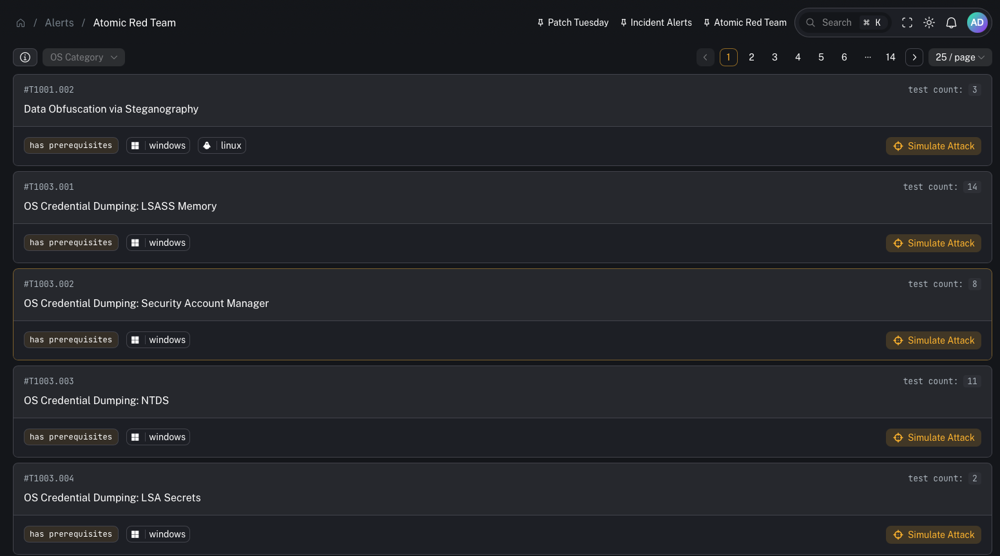

# Atomic Red Team (detection simulation)

Atomic Red Team is a detection validation workflow: you simulate known adversary behaviors (“atomic tests”) and confirm your stack detects what it should.

In CoPilot, this is commonly used to:
- validate that **telemetry is flowing** end-to-end
- verify your **Wazuh detection rules** are triggering as expected
- identify blind spots and tuning opportunities before a real attacker shows up

---

## What it is

Atomic Red Team is a library of small, self-contained tests mapped to the **MITRE ATT&CK** framework.

Regularly running these tests helps:
- prevent detection drift
- validate new rules and changes
- confirm the “alerting pipeline” still works after upgrades

---

## Why this is a power feature

Detection simulation isn’t required for initial SIEM bring-up, but it’s one of the best ways to build confidence in your detections.

It’s especially valuable when:
- you just deployed new Wazuh rules
- you changed Sysmon collection or agent group configs
- you’re onboarding a new customer and need to prove coverage

---

## How it works (high level)

The workflow shown in the videos:

1) Install Atomic Red Team on an endpoint (Windows or Linux)
2) Use a **Velociraptor artifact** to run a chosen atomic test remotely
3) Confirm events are collected and shipped (agent → manager/indexer → Graylog/CoPilot)
4) Validate:
   - the expected alert fired
   - the alert arrived in the right place (SIEM views and/or Incident Management)

---

## Operator workflow (practical)

1) Choose a technique/test you want to validate (start with something safe)
2) Run it on a **dedicated test endpoint** (recommended)
3) Watch for:
   - Wazuh alert firing
   - the event appearing in SIEM search
   - the alert being routed into Incident Management (if that’s part of your pipeline)
4) If it didn’t fire:
   - validate telemetry collection (Sysmon/auditd)
   - validate rule logic and mapping
   - validate routing/streams/event definitions

---

## Setup checklist

### 1) Use a safe test target

- Prefer a **lab endpoint** (not production)
- Document which tests you run and when

### 2) Install Atomic Red Team

The videos demonstrate installing Atomic Red Team so the test library exists locally on the endpoint.

### 3) Import Velociraptor artifacts to run tests remotely

A key improvement is using Velociraptor artifacts to run tests without manually SSH/RDP’ing into hosts.

Canonical repo for the Atomic Red Team Velociraptor artifacts:
- https://github.com/socfortress/VELOCIRAPTOR-ATOMIC-RED-ARTIFACTS

The videos reference:
- a Windows Atomic test execution artifact
- a Linux attack simulation artifact

Once imported into Velociraptor, CoPilot/Velociraptor can run tests in a repeatable way.

### 4) Validate detection + routing

Use CoPilot to confirm the end-to-end path:
- detections trigger in Wazuh
- events are searchable in your datastore
- alerts show up where you expect (SIEM views vs Incident Management)

---

## Where to find it

- UI: [Atomic Red Team (alerts view)](/user/ui/alerts-atomic-red-team)

---

## Gotchas

- Don’t run aggressive tests on production systems.
- Some tests can create artifacts (scheduled tasks, registry changes, etc.). Understand cleanup behavior before running.
- A “failed” test is still useful: it often reveals missing telemetry, broken routing, or overly strict rule logic.

---

## Related repositories

- Velociraptor Atomic Red artifacts:
  - https://github.com/socfortress/VELOCIRAPTOR-ATOMIC-RED-ARTIFACTS

## Video context

- Windows-focused validation workflow:
  - https://www.youtube.com/watch?v=TMJOBATTK9M

- Linux-focused validation workflow:
  - https://www.youtube.com/watch?v=tL3oNEx_3M8
