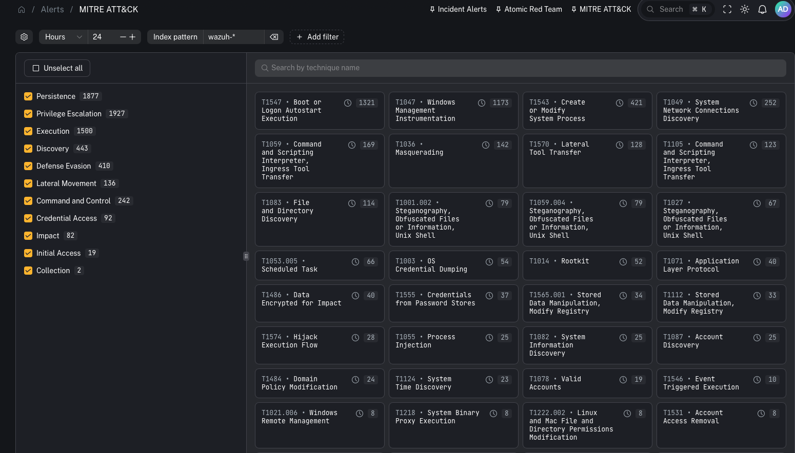
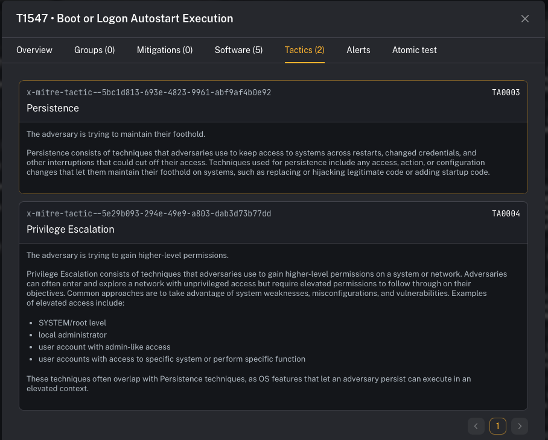
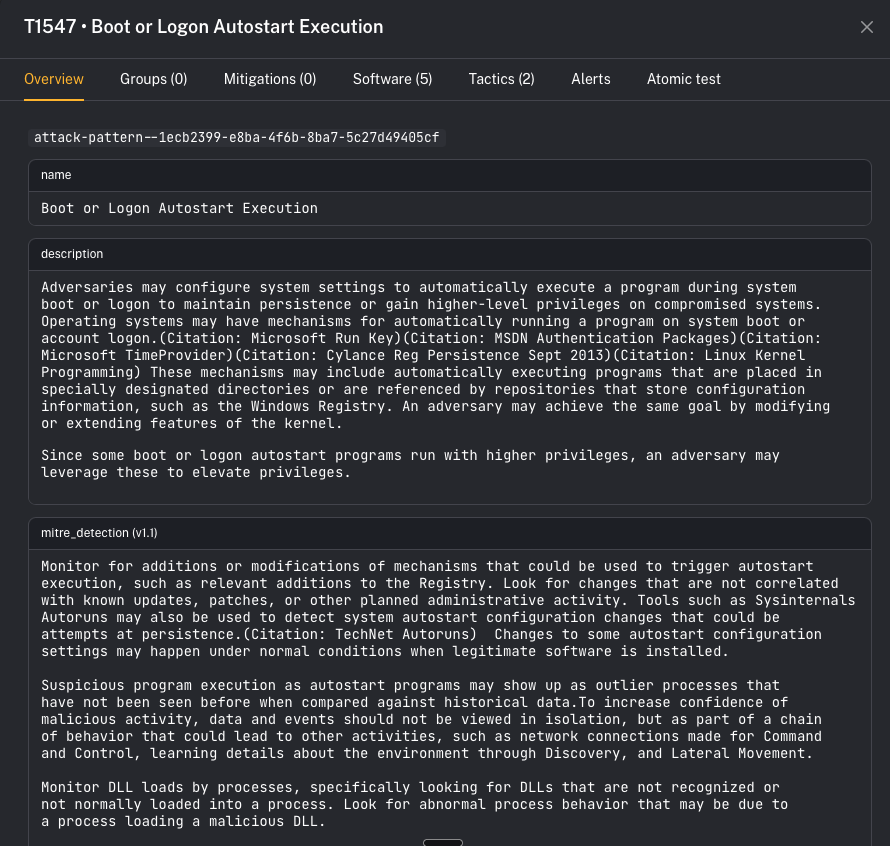

# MITRE ATT&CK integration

MITRE ATT&CK in CoPilot gives you a technique-centric lens across alerts/events. It’s useful for:
- coverage conversations (“what do we detect?”)
- investigation context (“what does this behavior usually mean?”)
- mapping detections to a globally recognized adversary behavior framework

---

## What it is

MITRE ATT&CK is a widely used framework that maps adversary behavior from **initial access** through **execution, persistence, lateral movement, and exfiltration**.

In CoPilot, the MITRE ATT&CK view is built from **MITRE technique IDs attached to Wazuh rules**.

Key idea:
- When a Wazuh rule fires and includes MITRE technique metadata, CoPilot can display that technique and group related events under it.

---

## Why this is a power feature

Most SIEM alert views are “alert-first.” MITRE ATT&CK flips it to “behavior-first.”

This helps:
- leadership and customers understand coverage in a standardized language
- analysts quickly interpret what a detection is *trying* to tell them
- detection engineers spot gaps (tactics/techniques you never hit)

---

## How technique enrichment works (Wazuh)

Wazuh’s rule syntax supports attaching MITRE technique IDs to a rule.

That means:
- default Wazuh rules can provide technique mappings
- your custom rules can also include technique IDs
- SOCFortress rules can include technique IDs as part of your tuned ruleset

When those rules generate events, CoPilot can present them inside the MITRE ATT&CK experience.

---

## What you can do in the UI

When you open a technique, CoPilot shows an overview page with:
- description
- references
- direct link out to the MITRE technique page

You can then pivot through supporting tabs such as:
- **Tactics** (the “why” / objectives)
- **Mitigations** (recommended controls)
- **Software** (tools/malware commonly associated)
- **Alerts / events** mapped to that technique
- **Atomic tests** (where available) to validate detections

---

## Operator workflow (practical)

Use MITRE ATT&CK when you want a fast interpretation loop:

1) Open **Alerts → MITRE ATT&CK**
2) Pick a technique showing activity
3) Review tactics/mitigations/software context
4) Pivot into the linked alerts/events for the concrete evidence
5) If you’re testing, run an Atomic test to validate end-to-end detection coverage

---

## Prerequisites

- Wazuh detections are flowing into the stack
- Your Wazuh rules include MITRE technique IDs (default rules + your custom rules)

---

## Gotchas

- MITRE mapping quality depends on rule metadata. If a rule has no technique ID, it won’t show up here.
- This view is best for context and coverage—not necessarily the primary incident queue.

---

## Where to find it

- UI: [MITRE ATT&CK (alerts view)](/user/ui/alerts-mitre)

---

## Video context

Walkthrough of the feature:
- https://www.youtube.com/watch?v=wK4aA7QrXmE
