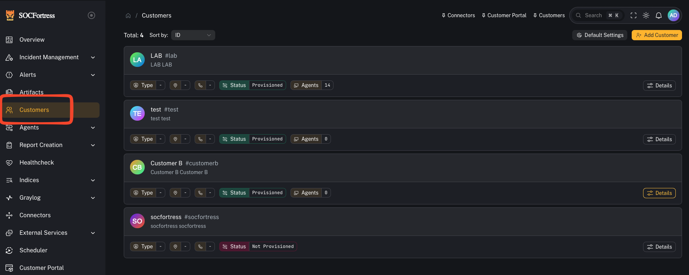

# Quickstart (Admins / Engineers)

## Where you spend most of your time

- **Connectors** (*Platform → Connectors & Integrations*): configure connectivity to the toolchain (Wazuh, Graylog, Grafana, Velociraptor, etc.).
- **Integrations** (*Platform → Connectors & Integrations*): configure per-customer integrations.
- **Scheduler** (*Platform → System*): enable/disable and tune background jobs/collectors.

## Core workflows

### 1) Configure connectors

- Add URLs / credentials
- Verify connectivity

### 2) Validate SIEM data availability

- Confirm Wazuh Indexer is reachable
- Confirm Graylog alerts are being written (often `gl-events*`)

### 3) Provision customer resources (if applicable)

- Use customer provisioning flows for Grafana/Graylog/Wazuh/Portainer where supported

### 4) Operationalize automation

- Enable scheduled collectors
- Confirm job metadata updates and error handling
