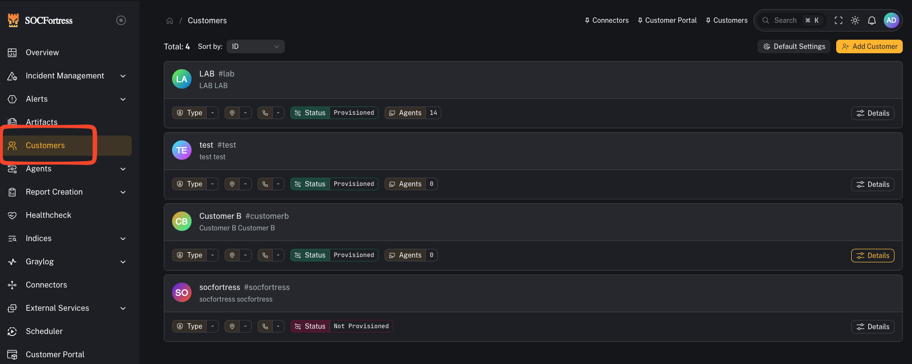

# Customer Provisioning (Tenancy Setup)

Customer provisioning is the **admin/engineer workflow** for onboarding a new customer/tenant into CoPilot and the surrounding OSS SIEM stack.

Provisioning is designed to create the *plumbing* that makes customer data land in the right place and makes dashboards usable immediately.

---

## What provisioning sets up

When you provision a customer, CoPilot will typically create:

### 1) Dedicated customer index + routing (Graylog → Wazuh Indexer)

- A **customer-specific index** (for example: `wazuh-<customer_code>`) with your chosen:
  - shards
  - replicas
  - retention (days of hot data)

- A **Graylog stream** for the customer’s events

- Stream rules that match on the customer identifier (commonly `agent.labels.customer == <customer_code>`)

- Stream → pipeline assignment so the customer’s data gets the expected normalization used by dashboards

> Why this matters: If events don’t route into the correct per-customer index, everything downstream breaks (alerts, dashboards, searching, reporting).

### 2) Wazuh agent groups (per OS)

Provisioning creates Wazuh groups that encode the customer identity, typically one per OS:

- `Windows-<customer_code>`
- `Linux-<customer_code>`
- `macOS-<customer_code>`

Agents enrolled into the customer’s group will emit events tagged with the customer label, enabling Graylog/Indexer routing.

### 3) Grafana organization + dashboards

Provisioning creates (or configures) in Grafana:

- A **Grafana organization** for the customer (recommended: same as the customer name/code)
- An **OpenSearch data source** pointing at the customer’s index pattern (wildcarded for Graylog daily rotation)
- A dashboards folder (for example: **EDR**) with default Wazuh dashboards

> This is the big win: the customer gets dashboards immediately without hand-building them.

---

## Prerequisites

Before provisioning, verify connectivity in **Connectors**:

- Graylog
- Wazuh Manager
- Grafana
- (Wazuh Indexer / OpenSearch)

If any connector is not verified, provisioning may partially fail.

---

## The two key fields: Customer Name vs Customer Code

### Customer Code (most important)

The **customer code** is the value used across the stack to correlate data to the correct tenant.

Common approach:
- use a short, stable, lowercase code (examples: `acme`, `contoso`, `socfortress-lab`)
- avoid spaces (use `-`)

> Once you provision with a customer code, treat it as **immutable**. Changing it later usually means re-provisioning or migrating data.

### Customer Name

The customer name is a human-friendly label (UI display, Grafana org naming convention, etc.).

---

## Step-by-step: Provision a customer

High-level flow (matches the provisioning wizard shown in the video below):

1) Go to **Customers** and create the customer
2) (If required) set defaults like the **Grafana URL**
3) Open the customer details and choose **Provision**
4) Configure Grafana org name
5) Configure index settings (name, shards, replicas, retention)
6) Select which dashboards to provision
7) Submit and wait for provisioning to complete

After provisioning, validate the results in:

- **Graylog**: index exists, stream exists, stream rules look correct, stream is assigned to the Wazuh processing pipeline
- **Wazuh Manager**: customer OS groups exist
- **Grafana**: org exists, OpenSearch data source exists, dashboards folder exists

---

## Validation checklist (quick)

- [ ] New customer appears in **Customers**
- [ ] Graylog customer index exists and matches naming convention
- [ ] Graylog stream exists for the customer and stream rules match the customer label
- [ ] Customer stream is assigned to the Wazuh pipeline (normalization)
- [ ] Wazuh groups exist (Windows/Linux/macOS) and include the customer label
- [ ] Grafana org exists
- [ ] Grafana OpenSearch data source index pattern uses wildcard (to include daily rotated indices)
- [ ] Default dashboards exist under the customer org

---

## Video walkthrough (source)

This guide is based on the customer provisioning walkthrough:

- **“Wazuh Dashboards in Grafana & Customer Provisioning in CoPilot!”**
  - https://www.youtube.com/watch?v=hC0JHY5WF-U

(We intentionally store **summaries** in docs and do not commit raw transcripts.)
