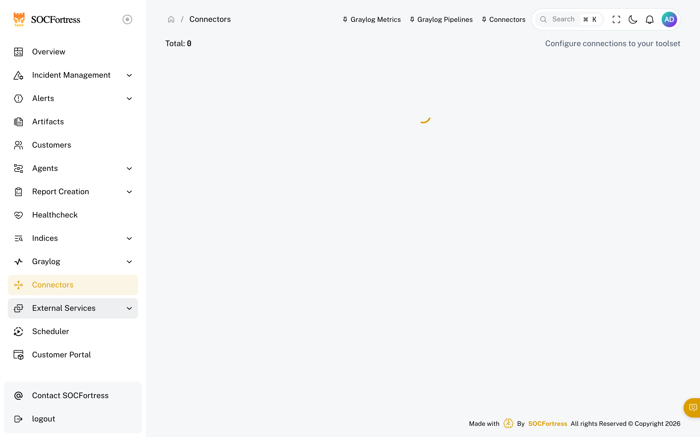
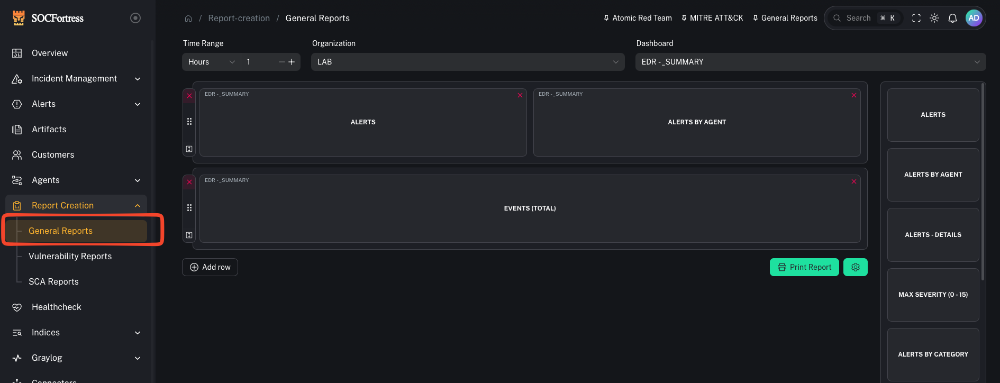

# Features by Area

This page is intended to make “hidden” features discoverable.

## Incident Management (operators)

- Alerts: triage, tagging, assignment, escalation
- Cases: create, link alerts, close lifecycle
- Comments: alert comments and case comments
- IoCs: attach IoCs to alerts
- Artifacts / datastores: case evidence files and report templates

## SIEM / Data (operators + engineers)
- Wazuh Indexer search-backed views (CoPilot often pivots using `index_name` + `index_id`)
- Graylog alerting events (commonly `gl-events*`)

## Integrations / Connectors (engineers)

- Connectors: configure and verify tool connectivity
- Network connectors: customer-scoped connector configs/keys
- Integration settings: customer integration configuration

## Reporting

- Grafana reporting and PDF generation
- Case report templates

## Automation

- Scheduler jobs (collectors, sync, alert creation)
- Active response (where enabled)
