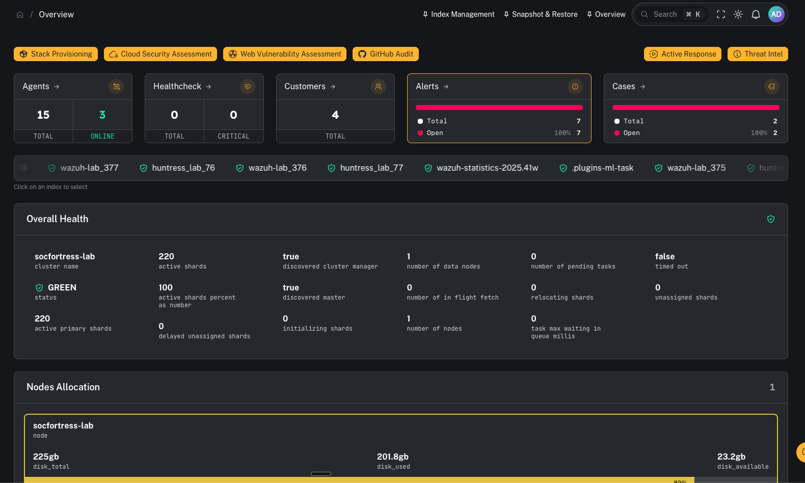

# Navigation Guide (UI Map + Tips)

This page explains what each left‑hand navigation item in CoPilot does and how to use the UI efficiently.

> Source of truth: `frontend/src/app-layouts/common/Navbar/items.tsx` (nav items) and `frontend/src/router/index.ts` (routes).

---

## Quick tips (applies to everyone)

- **Use the left nav as your workflow map**:
  - *Incident Management* = where analysts live (alerts/cases)
  - *Connectors / External Services / Indices* = where engineers wire up data and keep the stack healthy

- **Deep links exist** (helpful for bookmarking / SOPs):
  - Incident Alerts can be opened directly via `?alert_id=<id>`
  - Incident Cases can be opened directly via `?case_id=<id>`
  - Customers supports `?code=<customer_code>` and `?action=add-customer`
  - Graylog Management supports tab anchors like `#streams`, `#inputs`, etc.

---

## “Where do I start?” by role

### SOC operator / analyst

1. **Incident Management → Alerts** (`/incident-management/alerts`)
2. **Incident Management → Cases** (`/incident-management/cases`)
3. **Artifacts** (`/artifacts`) for evidence / files you need to attach or review

### Admin / engineer

1. **Connectors** (`/connectors`) – connect the underlying systems (Wazuh, Graylog, Grafana, Velociraptor, etc.)
2. **External Services** (`/external-services/...`) – configure third‑party sources / network connectors
3. **Indices → Index Management** (`/indices/management`) – index health/visibility and troubleshooting
4. **Graylog → Management** (`/graylog/management`) – alert plumbing / streams / inputs / provisioning

---

## Left navigation map (what each item does)

Below are screenshots of the main areas (from a lab environment) to help you quickly recognize where you are in the UI.

- Overview: 

  

- Incident Management → Alerts:

  

- Connectors:

  

- Indices → Index Management:

  

- Graylog → Management:

  

---

### Overview

- **Overview** → `/overview`
  - High-level dashboard/landing page once logged in.

### Incident Management (operator-first)

- **Incident Management → Sources** → `/incident-management/sources`
  - Defines/controls *where alerts come from* (your “alert sources” / categories).

- **Incident Management → Alerts** → `/incident-management/alerts`
  - Primary triage queue.
  - Deep link: `/incident-management/alerts?alert_id=<id>`

- **Incident Management → Cases** → `/incident-management/cases`
  - Investigation lifecycle management.
  - Deep link: `/incident-management/cases?case_id=<id>`

### Alerts (engineering/testing oriented)

- **Alerts → SIEM** → `/alerts/siem`
  - SIEM-centric alert view (Graylog-backed in current routing).

- **Alerts → MITRE ATT&CK** → `/alerts/mitre`
  - ATT&CK mapping view.

- **Alerts → Atomic Red Team** → `/alerts/atomic-red-team`
  - Adversary simulation / test harness view.

### Artifacts

- **Artifacts** → `/artifacts`
  - Evidence, files, and investigation artifacts.

### Customers

- **Customers** → `/customers`
  - Multi-tenant/customer context management.
  - Deep links:
    - `/customers?code=<customer_code>`
    - `/customers?action=add-customer`

### Agents (endpoint-facing capabilities)

- **Agents → Agents list** → `/agents`
- **Agents → Groups** → `/agents/groups`
- **Agents → Sysmon Config** → `/agents/sysmon-config`
- **Agents → Detection Rules** → `/agents/detection-rules`
- **Agents → CoPilot Actions** → `/agents/copilot-actions`
- **Agents → Vulnerability Overview** → `/agents/vulnerability-overview`
- **Agents → Patch Tuesday** → `/patch-tuesday` *(note: defined under Agents menu, but route is top-level)*
- **Agents → SCA Overview** → `/agents/sca-overview`

### Report Creation

- **Report Creation → General Reports** → `/report-creation/general`
- **Report Creation → Vulnerability Reports** → `/report-creation/vulnerability-reports`
- **Report Creation → SCA Reports** → `/report-creation/sca-reports`

### Healthcheck

- **Healthcheck** → `/healthcheck`
  - Health/status style overview (commonly used by admins/operators to confirm stack state).

### Indices (admin/ops)

- **Indices → Index Management** → `/indices/management`
  - Deep link supports `?index_name=<name>`.

- **Indices → Snapshot & Restore** → `/indices/snapshots`

### Graylog (admin/ops)

- **Graylog → Management** → `/graylog/management`
  - Supports hash navigation to tabs (example):
    - `/graylog/management#streams`
    - `/graylog/management#inputs`
    - `/graylog/management#events`

- **Graylog → Metrics** → `/graylog/metrics`

- **Graylog → Pipelines** → `/graylog/pipelines`
  - Supports `?rule=<something>` for jumping to a pipeline rule.

### Connectors (admin/engineer)

- **Connectors** → `/connectors`
  - Configure and validate connections to underlying stack services.

### External Services (admin/engineer)

- **External Services → 3rd Party Integrations** → `/external-services/third-party-integrations`
- **External Services → Network Connectors** → `/external-services/network-connectors`
- **External Services → Singul App Auth** → `/external-services/singul-app-auth`

### Scheduler

- **Scheduler** → `/scheduler`
  - Job scheduling / automation.

### Customer Portal

- **Customer Portal** → `/customer-portal`
  - Customer-facing portal view.

---

## Suggested mental model (helps teams onboard)

- **Operators**:
  - live in *Incident Management* and only dip into *Artifacts* and *Customers* as needed.

- **Admins/Engineers**:
  - spend time in *Connectors*, *External Services*, *Graylog*, and *Indices* to ensure the pipeline is healthy.

- **Detection engineering / testing**:
  - *Alerts (MITRE/Atomic Red Team)* + *Agents (Rules/Sysmon)* + *Scheduler*.
