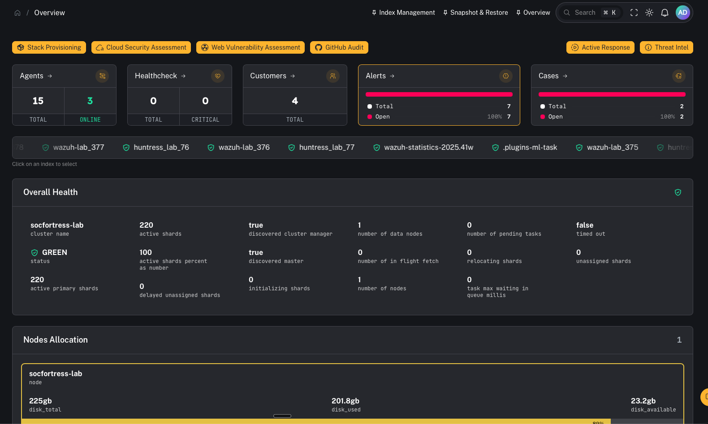
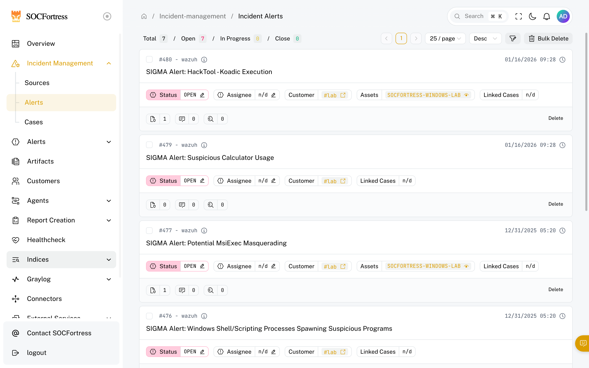
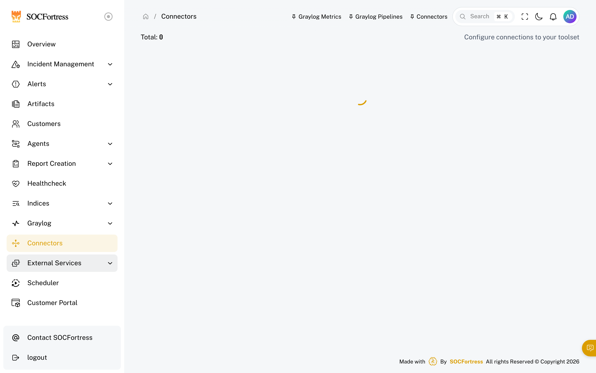
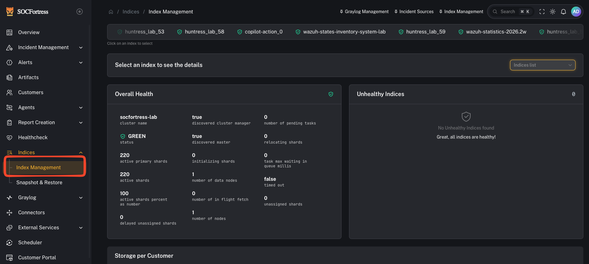
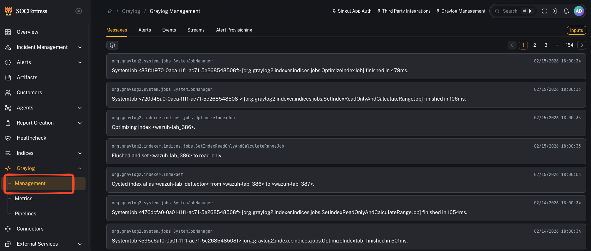

# Navigation Guide (UI Map + Tips)

This page explains what each left-hand navigation item in CoPilot does and how to use the UI efficiently.

> Source of truth: `frontend/src/app-layouts/common/Navbar/items.tsx` and the section files under `Navbar/items/` (menu), and `frontend/src/router/routes/` (routes).

---

## How the menu is organised

The sidebar follows the order SOC work happens in:

| Section | What it's for |
|---|---|
| **Overview**, **AI Analyst** | Where you land, and AI-assisted investigation |
| **Incidents** | The alert sources that feed the triage queue, then the queue itself: alerts, cases, case templates |
| **Investigate** | Digging into an alert: events, raw SIEM alerts, dashboards, file analysis, threat intel |
| **Respond** | Acting on an endpoint: active response, Velociraptor artifacts, CoPilot Actions |
| **Detections** | What fires: the catalog, CoPilot Searches, Wazuh rules, MITRE, Atomic Red Team |
| **Exposure** | Weaknesses to fix before they're exploited: vulnerabilities, Patch Tuesday, configuration assessment, cloud/web/GitHub assessments |
| **Endpoints** | The fleet: agents, agent groups, Sysmon config |
| **Customers** | Tenants and everything configured per customer |
| **Reports** | General, vulnerability and SCA reports |
| **Platform** | Deployment configuration: connectors and integrations, notifications, log management, health, access, system |

The avatar menu (top right) holds only what's about you: **Profile**, **Documentation**, **Contact SOCFortress** and **Logout**.

- **Deep links** (useful for bookmarks and SOPs):
  - Incident alerts open directly via `?alert_id=<id>`
  - Incident cases open directly via `?case_id=<id>`
  - Customers supports `?code=<customer_code>` and `?action=add-customer`
  - Graylog Management supports tab anchors such as `#streams` and `#inputs`

---

## "Where do I start?" by role

### SOC operator / analyst

1. **Incidents → Alerts** (`/incident-management/alerts`): the triage queue
2. **Incidents → Cases** (`/incident-management/cases`)
3. **AI Analyst** (`/ai-analyst`): AI-powered investigation, reports and Talon chat
4. **Investigate → Event Search** (`/event-search`) when an alert needs more context

### Admin / engineer

1. **Platform → Connectors & Integrations → Connectors** (`/connectors`): connect Wazuh, Graylog, Grafana, Velociraptor and the rest
2. **Platform → Connectors & Integrations → Integrations** (`/external-services/third-party-integrations`): per-customer third-party sources
3. **Platform → Log Management → Index Management** (`/indices/management`): index health and troubleshooting
4. **Platform → Log Management → Graylog Management** (`/graylog/management`): streams, inputs, provisioning

---

## Screenshots

From a lab environment, to help you recognise where you are:

- Overview:

  

- Incidents → Alerts:

  

- Platform → Connectors & Integrations → Connectors:

  

- Platform → Log Management → Index Management:

  

- Platform → Log Management → Graylog Management:

  

---

## Left navigation map (what each item does)

### Overview

- **Overview** → `/overview`
  - The landing dashboard once logged in.

### AI Analyst

- **AI Analyst** → `/ai-analyst`
  - AI-powered investigation hub: Talon chat, alert reports and architecture overview.

### Incidents

- **Incidents → Alert Sources & Exclusions** → `/incident-management/sources`
  - Which SIEM alerts get ingested as incidents, and the exclusion rules that suppress them. Define a source first: until one exists, nothing reaches the triage queue.
- **Incidents → Alerts** → `/incident-management/alerts`
  - The primary triage queue.
  - Deep link: `/incident-management/alerts?alert_id=<id>`
- **Incidents → Cases** → `/incident-management/cases`
  - Investigation lifecycle management.
  - Deep link: `/incident-management/cases?case_id=<id>`
- **Incidents → Case Templates** → `/incident-management/case-templates`

### Investigate

- **Investigate → Event Search** → `/event-search`
  - Search and filter raw events.
- **Investigate → SIEM Alerts** → `/alerts/siem`
  - Raw alerts from the SIEM indices (Graylog-backed). Not the triage queue: that's **Incidents → Alerts**.
- **Investigate → Dashboards** → `/dashboards`
- **Investigate → File Analysis** → `/file-analysis`
- **Investigate → Threat Intel**: opens the threat intel lookup panel (SOCFortress, VirusTotal, OpenCTI).
- **Investigate → OpenCTI** → `/opencti`
  - Only shown once the OpenCTI connector is verified.

### Respond

- **Respond → Active Response**: opens the active response wizard.
- **Respond → Artifacts** → `/artifacts`
  - Velociraptor collection, commands and quarantine.
- **Respond → CoPilot Actions** → `/agents/copilot-actions`

### Detections

- **Detections → Catalog** → `/detection-catalog`
  - Browse CoPilot Searches by story, the full Wazuh ruleset, coverage gaps and compliance mappings.
- **Detections → CoPilot Searches** → `/copilot-searches`
- **Detections → Wazuh Rules** → `/agents/detection-rules`
  - The Wazuh rule-file editor (formerly *Agents → Detection Rules*).
- **Detections → MITRE ATT&CK** → `/alerts/mitre`
- **Detections → Atomic Red Team** → `/alerts/atomic-red-team`
  - Adversary simulation / test harness.

### Exposure

- **Exposure → Vulnerabilities** → `/agents/vulnerability-overview`
- **Exposure → Patch Tuesday** → `/patch-tuesday`
- **Exposure → Configuration Assessment → SCA Overview** → `/agents/sca-overview`
- **Exposure → Configuration Assessment → SCA Policies** → `/agents/sca-policies`
- **Exposure → Cloud Security Assessment** → `/cloud-security-assessment`
- **Exposure → Web Vulnerability Assessment** → `/web-vulnerability-assessment`
- **Exposure → GitHub Audit** → `/github-audit`

### Endpoints

- **Endpoints → Agents** → `/agents`
- **Endpoints → Agent Groups** → `/agents/groups`
- **Endpoints → Sysmon Config** → `/agents/sysmon-config`

### Customers

- **Customers** → `/customers`
  - Multi-tenant / customer context management.
  - Deep links: `/customers?code=<customer_code>`, `/customers?action=add-customer`

### Reports

- **Reports → General Reports** → `/report-creation/general`
- **Reports → Vulnerability Reports** → `/report-creation/vulnerability-reports`
- **Reports → SCA Reports** → `/report-creation/sca-reports`

### Platform

Visible to analysts as well as admins. The items marked *(admin only)* are hidden from analysts.

- **Connectors & Integrations**
  - **Connectors** → `/connectors`: configure and verify connections to the stack services
  - **Integrations** → `/external-services/third-party-integrations`
  - **Network Connectors** → `/external-services/network-connectors`
  - **Shuffle App Auth** → `/external-services/shuffle-app-auth`
- **Notifications** *(admin only)*
  - **Internal Routes** → `/internal-notifications`
  - **Message Templates** → `/message-templates`
- **Log Management**
  - **Index Management** → `/indices/management` (deep link: `?index_name=<name>`)
  - **Snapshot & Restore** → `/indices/snapshots`
  - **Graylog Management** → `/graylog/management` (tab anchors: `#streams`, `#inputs`, `#events`)
  - **Graylog Metrics** → `/graylog/metrics`
  - **Graylog Pipelines** → `/graylog/pipelines` (jump to a rule with `?rule=<name>`)
- **Health**
  - **Healthcheck Alerts** → `/healthcheck/alerts`
  - **Metrics** → `/healthcheck/metrics`
- **Access**
  - **Users** → `/users`
  - **SSO** → `/sso-config` *(admin only)*
  - **Audit Log** → `/audit` *(admin only)*
- **System**
  - **Scheduler** → `/scheduler`
  - **Logs** → `/logs`
  - **License** → `/license`
  - **Stack Provisioning**: opens the stack provisioning wizard
  - **Customer Portal** → `/customer-portal`

---

## Avatar menu (top right)

- **Profile** → `/profile`
- **Documentation** → [docs.socfortress.co](https://docs.socfortress.co/) *(external)*
- **Contact SOCFortress** → [socfortress.co/contact-us](https://www.socfortress.co/contact-us) *(external)*
- **Logout**

---

## Suggested mental model (helps teams onboard)

- **Operators** live in *Incidents*, *AI Analyst* and *Investigate*. Select a customer in the sidebar filter first, then triage.
- **Detection engineers** work in *Detections* (and *Endpoints → Sysmon Config*), with *Platform → System → Scheduler* for scheduled jobs.
- **Admins / engineers** spend their time in *Platform*: connectors and integrations, log management and health.
