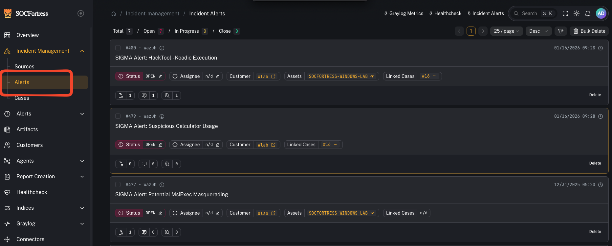
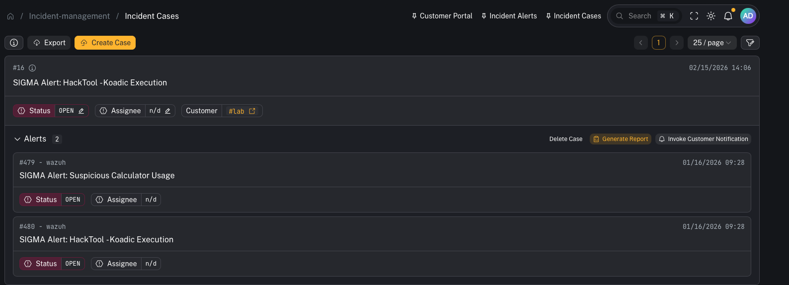
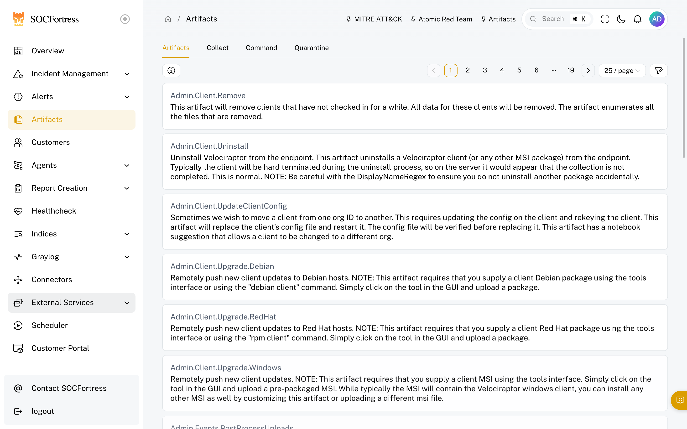

# Quickstart (SOC Operators)

## Where you spend most of your time

- **Incident Management → Alerts**: triage, investigate, and decide next actions.
- **Incident Management → Cases**: manage the lifecycle of incidents.

## Core workflows

### 1) Triage an alert
- Open alert details
- Review assets/context
- Add tags (use your tagging taxonomy)
- Add comments and assign if needed

### 2) Create and link a case

- Create a case from the alert when it needs tracking
- Link related alerts to the same case

### 3) Attach evidence (artifacts)

- Upload case artifacts (files, exports)
- Use report templates when generating customer-ready PDFs

### 4) Use SIEM search context
- When an alert references `index_name` + `index_id`, use the SIEM view to pivot into surrounding events

## If you can’t see alerts you expect
- Your org may have **tag-based access control** enabled (alerts require an allowed tag).
- See: **Developer / AI Agent Docs → Database Schema → Tag access control and alert visibility** for the underlying model.
