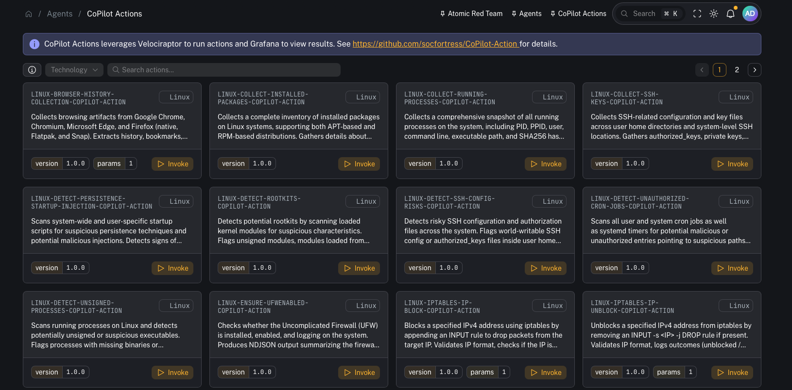
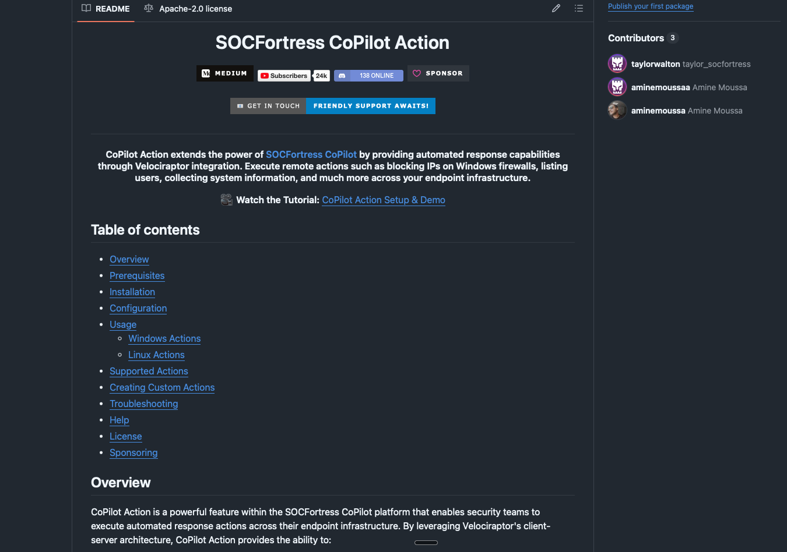
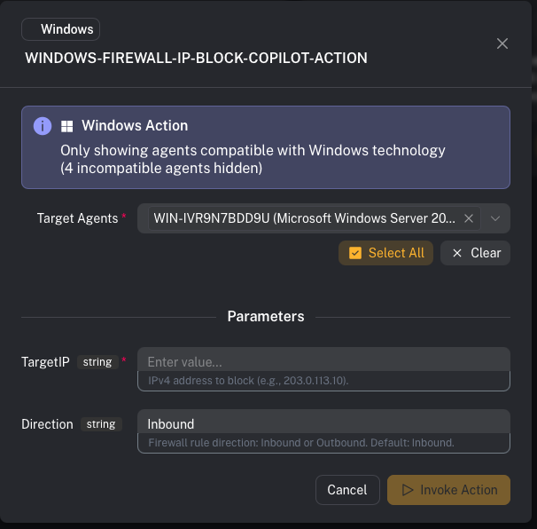

# CoPilot actions

**Menu:** Agents → CoPilot Actions

CoPilot Actions provides a more flexible way to launch endpoint actions (response + collection) across your infrastructure.

At a high level it combines:
- **CoPilot** (operator UI)
- **Velociraptor** (executes artifacts to run the action)
- **Custom scripts** (the action logic)
- **Grafana** (dashboards to visualize action results)

Repo (required for setup assets + implementation details):
- https://github.com/socfortress/CoPilot-Action

---

## Why this exists (vs “traditional Wazuh Active Response”)

Wazuh Active Response is powerful, but at scale it can become cumbersome to:
- deploy scripts to endpoints
- keep action logic consistent across OSes
- manage parameters and rollouts cleanly

CoPilot Actions is designed to make automated responses **simpler to run and easier to operationalize**.

---

## How it works

Conceptually:

1) You choose an action in CoPilot
2) CoPilot invokes a **Velociraptor artifact** (Windows or Linux)
3) The artifact downloads/executes the **action script** for the selected action
4) Results are written to logs and ingested into the stack
5) Grafana dashboards let you explore outcomes over time

CoPilot’s own UI also shows:
- supported OS/technology
- action metadata + description
- a link to the underlying source code repo for the action

---

## Prerequisites

- CoPilot is deployed and you can access **Agents → CoPilot Actions**.
- Velociraptor server + clients are deployed (the CoPilot-Action repo recommends Velociraptor **0.74.1+**).
- CoPilot can authenticate to Velociraptor (Connector configured).

---

## Setup checklist (recommended)

This is the practical “get it working end-to-end” checklist.

### 1) Import the required Velociraptor artifacts

From the repo:
- `velociraptor/Linux.Execute.RemoteBashScript.yaml`
- `velociraptor/Windows.Execute.RemotePowerShellScript.yaml`

Import them into Velociraptor (UI):
- **View Artifacts → Upload Artifacts**

Why: these artifacts are the execution layer that downloads and runs action scripts consistently.

### 2) Confirm the CoPilot ↔ Velociraptor connector

In CoPilot, configure and test the Velociraptor connector:
- **Connectors → Velociraptor**

Why: CoPilot needs API access to launch the artifact executions.

### 3) Ensure endpoints can download action scripts

CoPilot Actions commonly downloads scripts from public GitHub repos.

Verify:
- endpoints have egress to `raw.githubusercontent.com` (or wherever your scripts live)
- DNS + TLS inspection/proxy rules won’t block downloads

### 4) (Windows) Verify PowerShell can run scripts

If a Windows action relies on PowerShell, validate the execution policy and permissions on target endpoints.

(Example from the repo docs: `RemoteSigned` at `LocalMachine` scope.)

### 5) Create SIEM routing for action output (Graylog)

Recommended pattern:
- Create a dedicated **Graylog index set** (e.g., `copilot_action`)
- Create a **Graylog stream** that routes CoPilot Action output to that index

Why: action output is operational/response telemetry—keep it searchable without polluting core security logs.

### 6) Add/verify Wazuh rule support for action output

Action output is typically written to active response logs that the Wazuh agent already ships.

Add/verify the supporting detection rules so the Wazuh manager can identify/classify “CoPilot Action” results.

### 7) Import Grafana dashboards (optional but recommended)

The CoPilot-Action repo includes dashboards under:
- `Grafana/`

Import them into Grafana and point the datasource at the CoPilot Action index.

Why: dashboards make it much easier to confirm actions are firing and to review results across time.

---

## Repo pointers

Everything you need to stand this up (artifacts + dashboards + docs) lives in:
- https://github.com/socfortress/CoPilot-Action

---

## Common tasks

### Find an action

Use search to filter actions by name/technology.

### Invoke an action

Typical flow:
1) Select an action
2) Review metadata (OS support, parameters)
3) Select a target agent
4) Invoke

Examples shown in the video:
- collecting browser history
- blocking an IP address via Windows Firewall

### View results

Results can be viewed:
- in Grafana dashboards (recommended for trending/overview)
- in Velociraptor execution logs/results (best for deep troubleshooting)

---

## Troubleshooting (fast checks)

If an action fails:
- Confirm the required Velociraptor artifacts exist and are runnable
- Check the Velociraptor artifact execution **logs/results** for errors
- Verify Graylog stream/index routing if you expect results in dashboards
- Confirm endpoint prerequisites (PowerShell availability, script paths, permissions)

---

## Gotchas

- Actions can be disruptive (containment/firewall changes). Use approvals + logging.
- Start by testing actions on a lab endpoint and then roll out.
- Ensure your routing keeps action output separated from core security telemetry.

---

## Video context

Feature walkthrough + setup approach:
- https://www.youtube.com/watch?v=l9OLtgemYOQ
