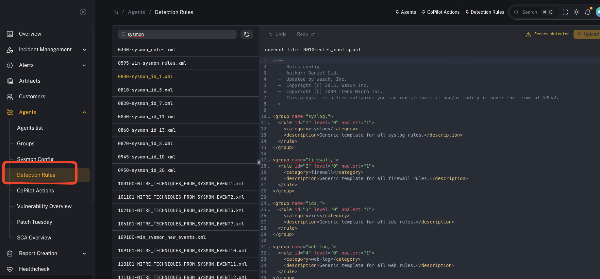
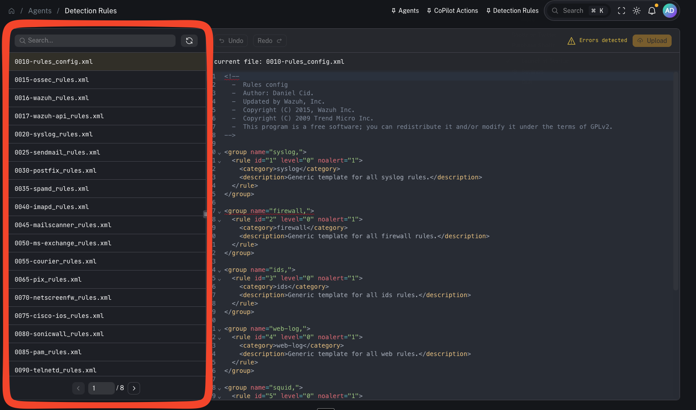
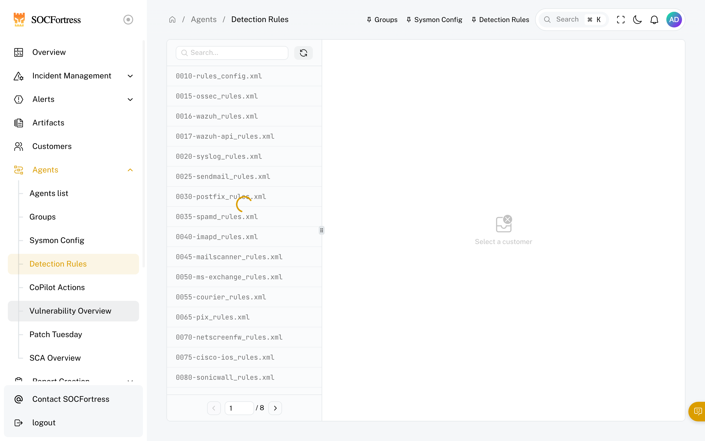
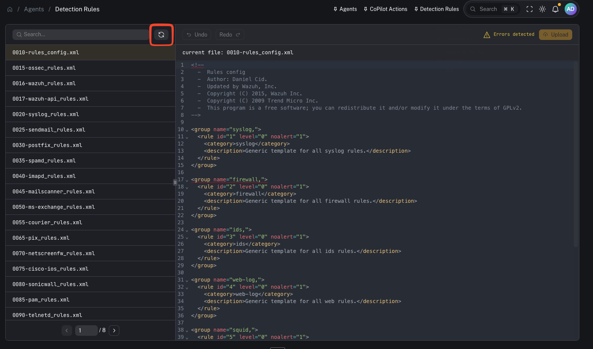

# Detection rules (Wazuh)

**Menu:** Agents → Detection Rules

Detection rules in CoPilot map to **Wazuh detection rules**. These rules are what Wazuh uses to generate alerts from decoded telemetry.

CoPilot lets you **view, search, and manage** these rules without SSH’ing into the Wazuh manager.

---

## What you’re looking at

This page exposes the rule files that live on the **Wazuh manager** (e.g., the standard `*_rules.xml` files and your local exclusions/custom rules).

Key point:
- **Rules still live on the Wazuh manager.** CoPilot pulls them via API and can upload/save changes back to the manager.

---

## Why this matters

Rules are one of your main control points for:
- reducing noisy alerts (exclusions)
- adding new detection logic for emerging threats
- aligning alerting to what you actually care about in a given customer environment

---

## Common tasks

### Search for rules

Use search when you need to:
- find a rule by **ID**
- locate a specific field match / keyword
- quickly identify which file contains the logic you need to adjust

### Add an exclusion (reduce noise)

A typical workflow (from the video):
1) Open your exclusions/custom rule file
2) Add or modify a rule (incrementing the rule ID when needed)
3) Update the match conditions/fields
4) Save/upload the file

### Upload/save changes to the Wazuh manager

After editing, you must upload/save so the updated file is written to the manager.

Important:
- Saving changes updates the file on the **Wazuh manager**.

### Restart Wazuh to apply rule changes

Rule changes typically require a Wazuh manager restart/reload to take effect.

Operational note:
- Treat restarts as a controlled change (maintenance window, customer comms if needed).

---

## When to use it

Use Detection Rules when you need to:
- reduce false positives / noisy detections
- validate why an alert did or did not fire
- tune alert fidelity for a specific customer
- add detection logic for a new threat/use case

---

## Gotchas

- Rule changes can impact alert volume immediately—roll out carefully and document changes.
- Keep ownership/change control clear (avoid ad-hoc production edits).
- Any restart/reload step should be treated as operationally significant.

---

## Video context

This page and workflow are demonstrated here:
- https://www.youtube.com/watch?v=31lCr80-NVM
