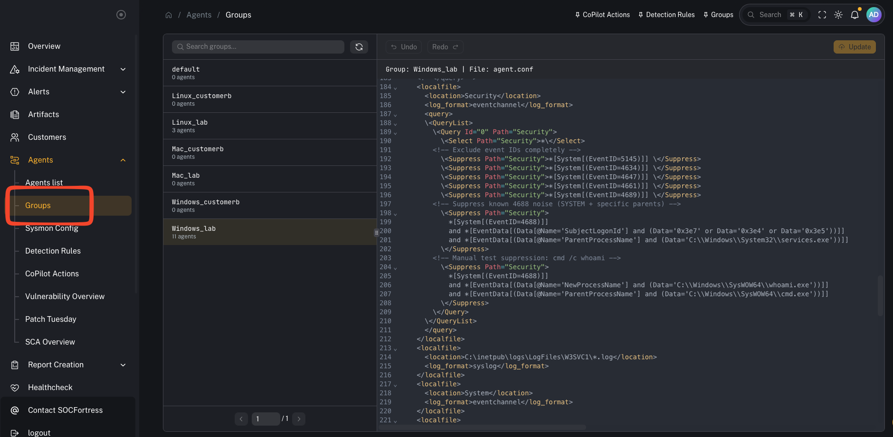
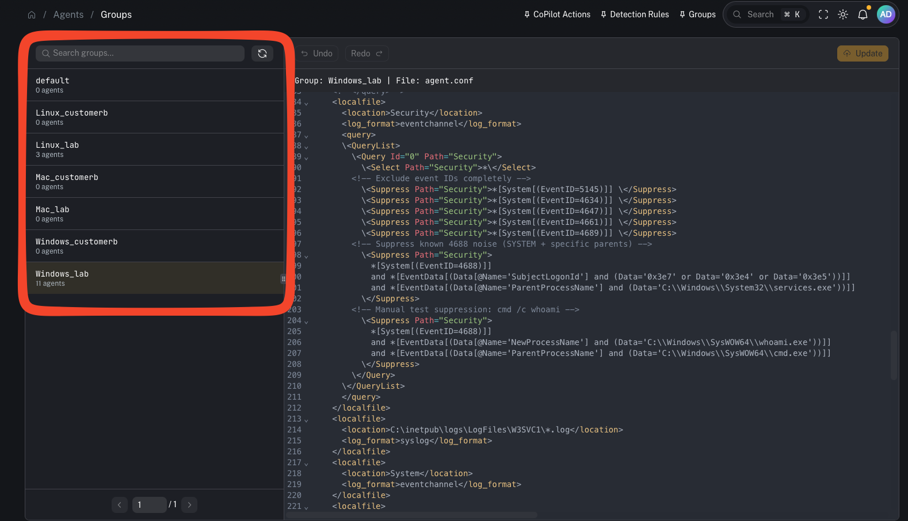
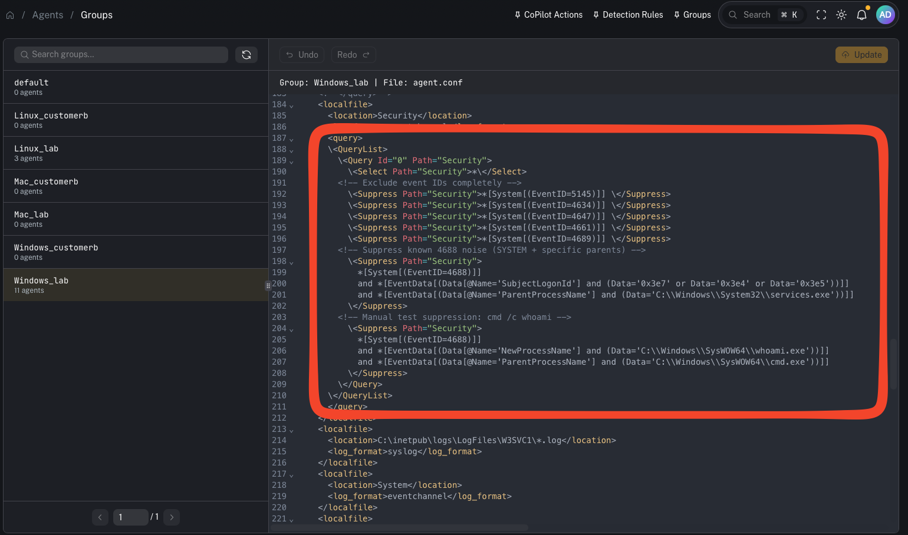

# Agent groups (Wazuh)

**Menu:** Agents → Groups

Agent groups in CoPilot map to **Wazuh agent groups**. Wazuh uses these groups to apply endpoint configuration such as:
- log collection settings
- Security Configuration Assessment (SCA) policy configuration
- File Integrity Monitoring (FIM) configuration

---

## What you’re looking at

This page shows:
- the list of Wazuh groups
- how many agents are in each group
- group details/config once selected

Multi-tenancy note:
- Groups are typically created **per customer**.
- We usually also split by **operating system** (Windows / Linux / macOS).

Common naming pattern:
- `Windows_<customer_code>`
- `Linux_<customer_code>`
- `Mac_<customer_code>`

Example groups visible in the lab:
- `Windows_lab`, `Linux_lab`, `Mac_lab`

---

## Why groups matter

Groups are one of the highest leverage controls in the stack:

- They define what telemetry is collected and shipped to the Wazuh Manager.
- They standardize configuration across fleets (repeatable, auditable).
- They help prevent SIEM bloat by letting you suppress noise **at the agent**, before it ever hits the manager/indexer.

---

## Common tasks

### Add an agent to a group

Typical workflow:
1) Identify the agent
2) Assign it to the correct customer + OS group
3) Verify the agent receives updated configuration

### Validate a group is applied

In Wazuh terms, group configuration ends up under the manager’s shared group config and is pushed down to agents.

---

## Advanced: group configuration fields (why they’re powerful)

Group configuration is where you can:
- tune Windows EventChannel collection
- apply QueryList include/exclude logic
- configure SCA policy behavior
- adjust FIM rules

### Using groups to reduce SIEM noise (from the video)

Windows Security events can be extremely noisy. If you filter noise only on the **Wazuh Manager**, the manager still has to:
- receive the event
- parse/decode it
- evaluate it against rules

A better performance move is to suppress events at the **Wazuh agent**, so they are **never shipped** to the manager in the first place.

Approach (high level):
1) Start with broad collection (so you know what you’re getting)
2) Identify noisy event IDs / patterns
3) Add suppressions in the group’s agent configuration (QueryList / suppression rules)
4) Validate the agent received the updated config and the noise stopped upstream

This improves:
- Wazuh Manager performance
- indexer storage consumption
- Graylog pipeline load
- downstream alerting signal-to-noise

Video context:
- https://www.youtube.com/watch?v=_vfd9eslwN0

---

## Gotchas

- Group config syntax can be sensitive (especially Windows event query filters). Make small changes and validate.
- Don’t suppress blindly—ensure you’re not hiding high-signal events you need for detection.
