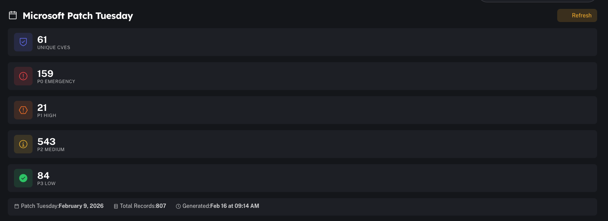
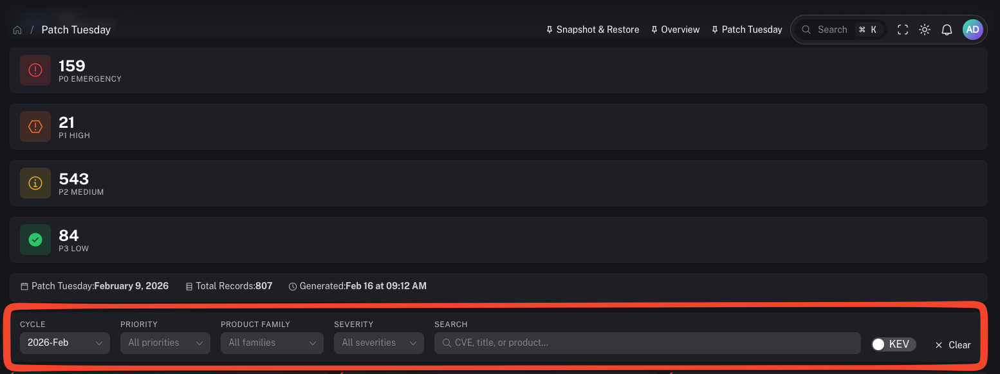
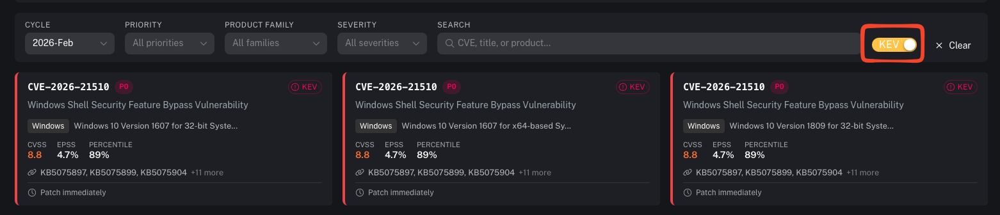

# Patch Tuesday (Microsoft)

**Menu:** Agents → Patch Tuesday

Patch Tuesday is a patch-cycle view focused on **Microsoft Patch Tuesday** releases. It helps you triage CVEs for a given patch cycle and prioritize what to patch first using:
- priority bands (**P0–P3**)
- **KEV** (Known Exploited Vulnerabilities)
- **CVSS** severity
- **EPSS** (exploit likelihood)
- affected product family / product

---

## What you’re looking at

### Cycle summary

At the top, you’ll see:
- count of **unique CVEs**
- counts by priority (P0 Emergency, P1 High, P2 Medium, P3 Low)
- the patch cycle date and generation timestamp

Use this for:
- a fast “how big is this month?” snapshot
- tracking backlog reduction over the patch window

### Filters

You can filter by:
- **Cycle** (e.g., `2026-Feb`)
- **Priority**
- **Product family**
- **Severity**
- **Search** (CVE, title, product)

### KEV toggle

Turn on **KEV** to focus on vulnerabilities that are known to be exploited.

### CVE cards

Each CVE entry typically includes:
- CVE ID + title
- priority (P0–P3)
- KEV indicator (when applicable)
- product family and affected products
- CVSS
- EPSS + percentile
- associated KBs / updates (when available)

---

## How to use this page (operator workflow)

A practical monthly flow:

1) **Start with KEV + P0**
   - Turn on KEV
   - Filter to P0 (Emergency)
   - Patch these first (or implement compensating controls immediately)

2) **Use EPSS to prioritize within a priority band**
   - When you have many P1/P2 items, sort mentally by EPSS (higher likelihood first)

3) **Group work by product family**
   - Cluster Windows Server vs Workstations vs Office/Edge/etc.

4) **Coordinate by customer / environment**
   - In multi-tenant stacks, drive patch work per tenant and track completion

5) **Validate outcome**
   - Confirm patch deployment via your patch tooling
   - Re-check vulnerability posture in CoPilot after inventory refresh

---

## What P0–P3 means (recommended interpretation)

Use the priority bands as an urgency rubric:
- **P0 (Emergency):** patch immediately (especially if KEV/high EPSS)
- **P1 (High):** patch in the first wave of the cycle
- **P2 (Medium):** patch in the standard window
- **P3 (Low):** patch as capacity allows

Always combine this with:
- asset criticality
- exposure (internet-facing vs internal)
- compensating controls (EDR, network controls, app allowlisting)

---

## Prerequisites

- Patch Tuesday feed/data source is enabled and up-to-date
- Vulnerability data ingestion is working (for EPSS/CVSS enrichment where applicable)

---

## Gotchas

- Don’t treat CVSS as a patch order by itself—use KEV + EPSS + exposure + asset criticality.
- Patch Tuesday prioritization is about **urgency**, not just severity.
- Some environments require maintenance windows—use compensating controls when you can’t patch immediately.
