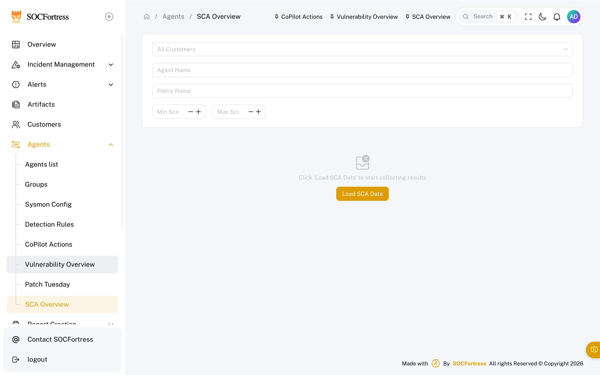
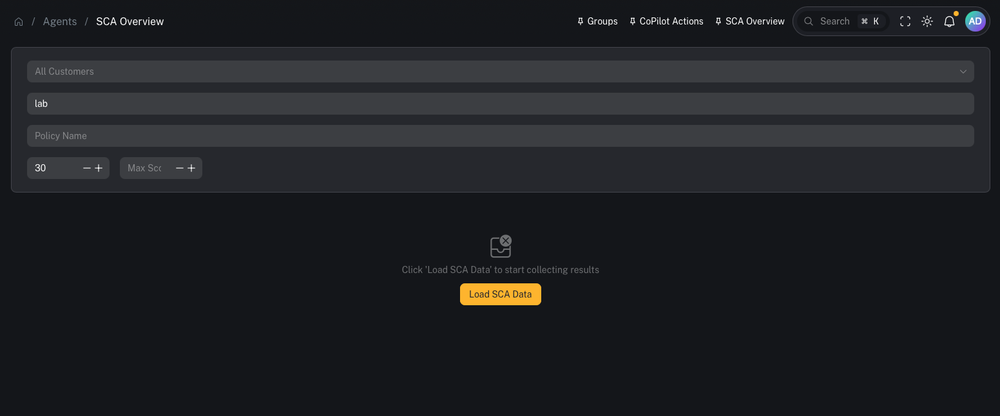
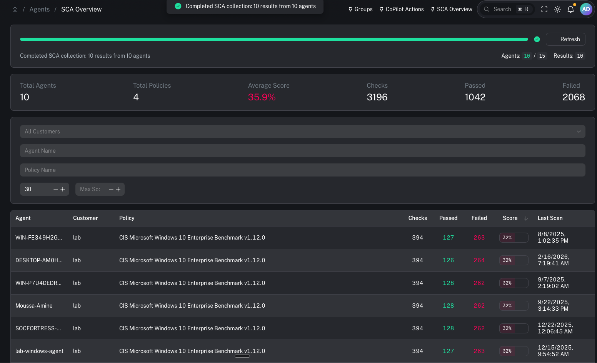

# SCA overview

**Menu:** Agents → SCA Overview

SCA (Security Configuration Assessment) is Wazuh’s secure configuration/hardening framework. It evaluates endpoints against policies (benchmarks) and reports pass/fail results so you can:
- find configuration drift
- measure baseline hardening posture
- prioritize remediation of failed controls

---

## What you’re looking at

### Filters

You can scope results by:
- **Customer** (multi-tenant)
- **Agent Name**
- **Policy Name**
- **Score range** (min/max)

### Load SCA Data

This page typically requires an initial fetch.

Use **Load SCA Data** to pull the latest SCA results into the view.

### Results view

Once loaded, you’ll use this page to identify:
- which agents are failing baseline policies
- which policies are producing the lowest scores
- where remediation work will produce the biggest posture improvement

---

## When to use it

Use SCA overview when you need to:
- identify endpoints failing hardening baselines
- find drift after a change window (GPO, tooling rollout, new images)
- support audits/compliance reporting with repeatable evidence

---

## Common tasks

### Triage low scores first

A practical flow:
1) Filter by customer
2) Set a **Max Score** threshold (start low)
3) Identify the bottom-scoring endpoints/policies
4) Remediate the highest leverage failures (the ones that apply broadly)

### Investigate and remediate failed checks

Use the agent’s dedicated page to drill down:
- open an agent and review the **SCA** tab for policy/check details

Remediation usually happens outside CoPilot (GPO, configuration management, image updates), then you validate by re-running SCA and confirming the score improves.

### Export / reporting

If you need a deliverable:
- see: [SCA report](/user/ui/report-sca)

---

## Prerequisites

- Wazuh SCA is enabled on agents
- Policies are deployed to the endpoints/groups you care about
- Agents are checking in and SCA scans have run

---

## Gotchas

- SCA is only as good as your policies and rollout. Keep policies consistent per OS/group/customer.
- Score changes often lag behind configuration changes (depends on scan cadence + agent check-in).
- Don’t chase perfect scores blindly—prioritize controls that reduce real risk for your environment.
