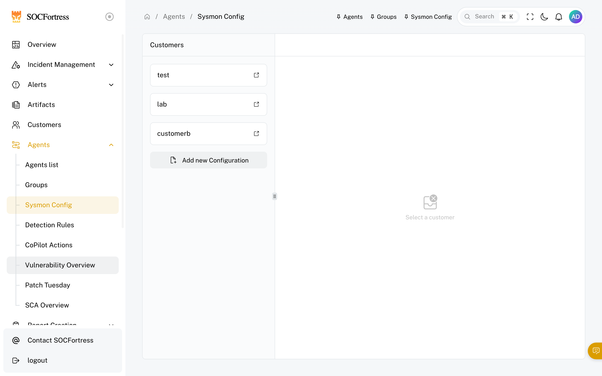
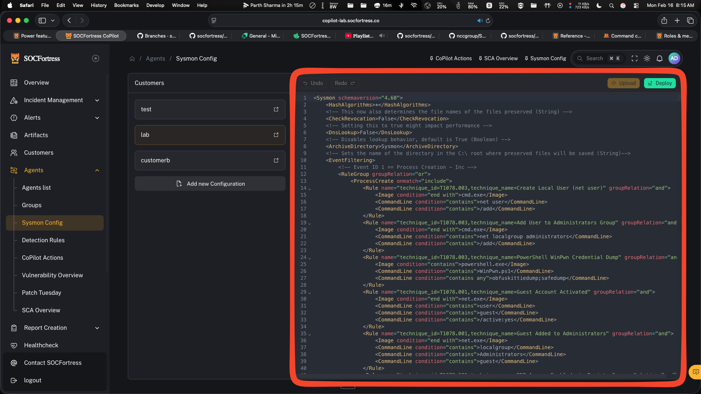
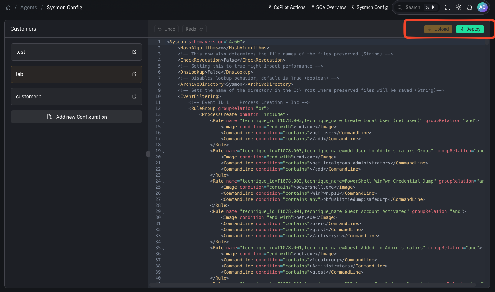

# Sysmon config (Windows)

**Menu:** Agents → Sysmon Config

Sysmon (System Monitor) is a Microsoft Sysinternals tool that logs high-value system activity to the **Windows Event Log**. We use it on Windows endpoints to collect richer telemetry (process, network, file, etc.) that improves detections and investigations.

In the CoPilot stack:
- **Sysmon** generates telemetry on the Windows endpoint
- The **Wazuh agent** collects Sysmon events
- The **Wazuh manager** is the source of truth and forwards that telemetry into the SIEM

---

## Why we use Sysmon

Windows Security logs are useful, but Sysmon provides additional, security-relevant telemetry that is widely adopted in SOC environments.

Benefits:
- higher-fidelity investigation data (what ran, how it ran, what it talked to)
- better detection coverage for common attacker techniques
- consistent event schemas when you standardize a baseline configuration

---

## What this page is

A centralized place to manage Sysmon configuration files so you can:
- keep Windows telemetry consistent across endpoints
- tune noise (exclude expected/benign activity)
- roll out changes per customer/group

---

## How Sysmon config management works in CoPilot (high level)

Based on the workflow in the video:

1) You maintain a Sysmon config (XML)
2) CoPilot writes the config into the appropriate Wazuh shared group directory (typically per Windows customer group)
3) Endpoints receive the updated file via Wazuh agent group sync
4) A reload mechanism applies the new Sysmon config without requiring a reboot (implementation depends on your environment)

---

## Step 1 — Review and edit the Sysmon config

Operator/engineer tips:
- Make small, intentional changes
- Track versions and keep a rollback path
- Prefer customer/group-specific configs when environments differ (EDR tools, server roles, etc.)

---

## Step 2 — Apply / reload the config

A practical pattern is to reload Sysmon after pushing a new config so changes take effect quickly.

Why this matters:
- you can respond to noise quickly (exclude noisy, expected software)
- you can add coverage quickly when a new detection need appears

---

## Using Sysmon to reduce SIEM noise

Sysmon configs can be very detailed. A common problem is “too much telemetry.”

Use this page to:
- exclude known-benign software that generates high event volume
- reduce ingestion costs (compute + storage)
- keep detections focused on high-signal telemetry

Example from the video context:
- if an endpoint is running an EDR tool and Sysmon is generating noisy events around specific event IDs, you can add exclusions so you don’t ingest bloat into the SIEM.

Video context:
- https://www.youtube.com/watch?v=XT1d49HTqQw

---

## Gotchas

- Sysmon configs can be complex—test changes on a small set of endpoints first.
- Any change can shift event volume dramatically—coordinate with index/retention planning.
- A broken config may fail to apply; keep validation and rollback procedures.
