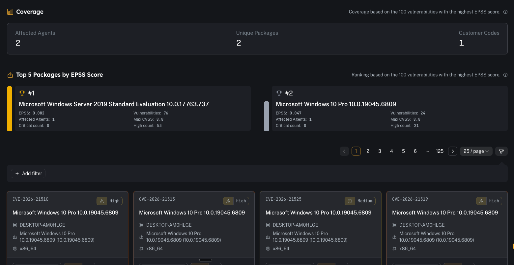
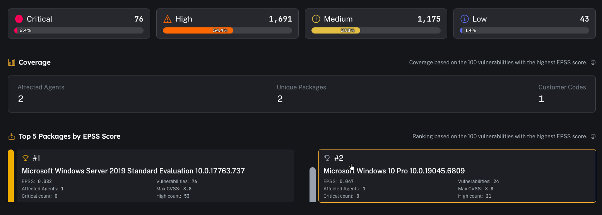
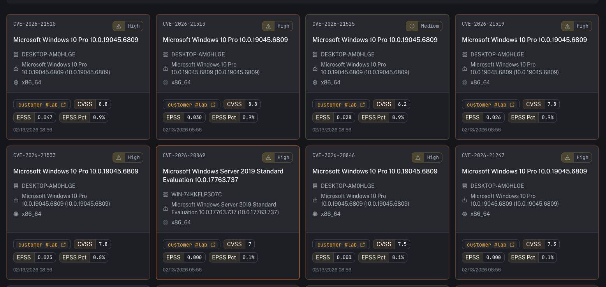
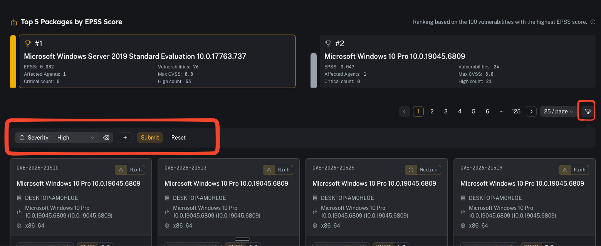

# Vulnerability overview

**Menu:** Agents → Vulnerability Overview

Vulnerability Overview provides near real-time vulnerability data (from **Wazuh Indexer**) enriched with **EPSS** scoring and package details, so you can prioritize remediation based on both severity and likely exploitation.

---

## What you’re looking at

### Distribution

A quick breakdown of vulnerabilities by severity (Critical / High / Medium / Low).

Use this for:
- “How bad is it right now?”
- tracking whether patching is reducing overall exposure

### Coverage + top packages by EPSS

This section highlights:
- how many **agents** are impacted
- how many **unique packages** are involved
- how many **customer codes** are represented

And surfaces packages/vuln clusters ranked by **EPSS** (a good “what should we care about first?” view).

### Detailed table

The table is the working view where you can pivot by:
- CVE
- severity
- affected agent/hostname
- package / OS / architecture
- **CVSS**
- **EPSS score** and **EPSS percentile**
- timestamp (when observed)

---

## EPSS (Exploit Prediction Scoring System) — how to use it

EPSS is a probability model maintained by FIRST that estimates the likelihood a CVE will be exploited “in the wild.”

In CoPilot you’ll typically see:
- **EPSS**: a score between **0 and 1** (higher means more likely exploitation)
- **EPSS Pct**: percentile ranking (how that CVE compares to other CVEs)

How to operationalize it:
- Use **CVSS** to understand *impact/severity*
- Use **EPSS** to understand *likelihood/urgency*
- Prioritize items that are **High CVSS + High EPSS** first

Rule of thumb:
- A Medium CVSS with a very high EPSS can be more urgent than a High CVSS with very low EPSS.

Reference:
- https://www.first.org/epss/

---

## Common tasks

### Filter by tenant/customer

Use filters to focus on one customer code at a time in multi-tenant environments.

### Identify “top risk” items

A practical triage flow:
1) Review **Top Packages by EPSS**
2) Open the package/CVE details
3) Identify affected agents
4) Create remediation tasks (patch/update/remove package)
5) Validate closure by confirming the item disappears as inventory updates

### Pivot to reporting

If you need a deliverable for a customer or internal patch window:
- use the reporting workflow described here: [Vulnerability report](/user/ui/report-vulnerability)

---

## Prerequisites

- Wazuh inventory (syscollector) is flowing for endpoints
- Wazuh vulnerability detection is enabled and indexing results

---

## Gotchas

- Stale inventory = stale posture. If an agent hasn’t checked in recently, its vulnerability list may be outdated.
- EPSS is a prioritization signal, not a guarantee—use it alongside your environment context (internet exposure, compensating controls, exploitability, asset criticality).
