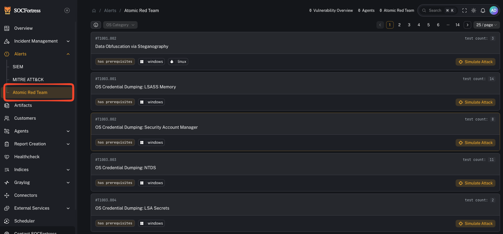

# Atomic Red Team

**Menu:** Alerts → Atomic Red Team

**Best for:** Operators + detection engineering / validation

Use Atomic Red Team workflows to:
- simulate attacker behaviors (Atomic tests)
- verify telemetry and alert routing end-to-end
- validate that detection rules are firing as expected

Related power feature:
- [Atomic Red Team (detection simulation)](/power-features/atomic-red-team)

