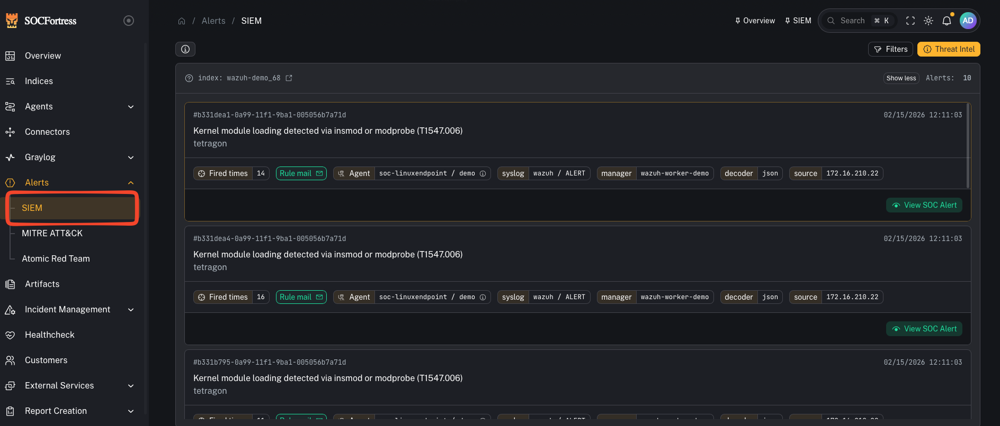

# SIEM

**Menu:** Alerts → SIEM

**Best for:** Both

This page shows a **high-level view of SIEM alerts** based on what **Graylog** indicates (using the filters on the page).

Important:
- These are **different from Incident Management alerts**.
- SIEM alerts shown here are **not created/managed** in CoPilot’s Incident Management queue.

Use this page for:
- a quick overview of alert volume and themes
- validating that Graylog alerting is working
- validating that alerts configured in Graylog are flowing into **Incident Management** when expected

It is **not** intended to be the primary analyst workflow surface for alert handling.

---

## How to use it (practical)

1) Apply your filters (customer/time window/stream/etc.)
2) Confirm Graylog is producing the alerts you expect
3) Pick an alert and pivot to underlying SIEM events (when available)
4) Cross-check whether a corresponding Incident Management alert exists (if your routing/provisioning is configured to create one)

---

## Gotchas

- If you see SIEM alerts here but not in Incident Management, it usually indicates an ingestion/routing gap (Graylog event definition/stream → CoPilot incident ingestion).
- If you only need the analyst queue, go to: [Incident alerts](/user/ui/incident-alerts)
