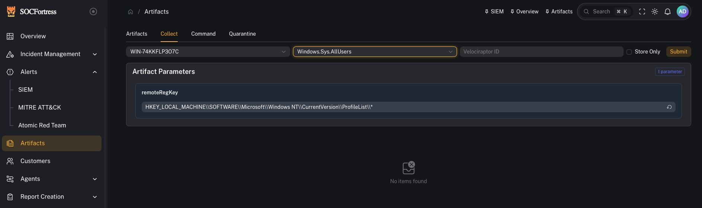
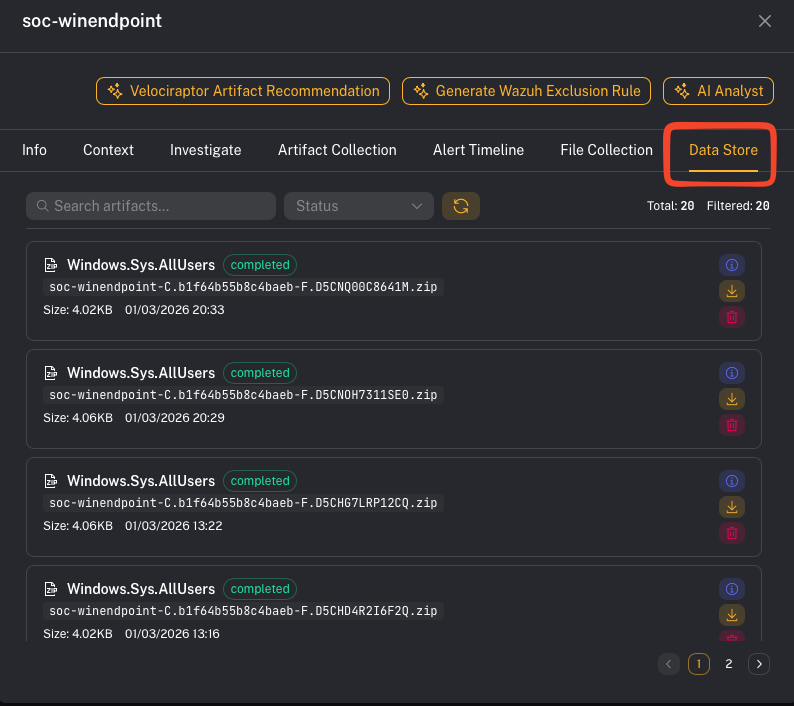
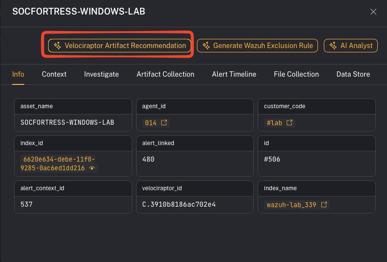

# Artifacts (Velociraptor)

**Menu:** Artifacts

CoPilot’s Artifacts feature integrates with **Velociraptor** (DFIR / threat hunting) to run **Velociraptor Artifacts** via the Velociraptor API and pull results back into CoPilot.

---

## What is Velociraptor?

Velociraptor is an advanced **digital forensics and incident response (DFIR)** platform that gives you endpoint visibility and targeted evidence collection at scale.

A few key concepts (Velociraptor terminology):
- **VQL**: Velociraptor Query Language (how evidence is collected)
- **Artifacts**: packaged collections (YAML) of one or more VQL queries + parameters + preconditions

Velociraptor artifacts are designed to be reusable and safe to run across fleets using **preconditions** (if a precondition fails, that source is skipped).

Reference:
- Velociraptor docs: https://docs.velociraptor.app
- Artifacts concept: https://docs.velociraptor.app/docs/vql/artifacts/

---

## What you can do in CoPilot

From an operator perspective, CoPilot lets you:

- **Select an endpoint** (agent/hostname / Velociraptor ID)
- **Choose an artifact** to run (collection)
- **Provide parameters** (when the artifact requires them)
- **Run the artifact** and review the returned results

---

## Before you start (required identifiers)

CoPilot needs a way to target the correct Velociraptor client.

In the UI you’ll typically see fields like:
- **Hostname** (optional)
- **Velociraptor ID** (the Velociraptor client id)

If the endpoint doesn’t have a valid Velociraptor ID mapped, collections won’t run against that host.

---

## Step 1 — Run an artifact collection

1) Open **Artifacts**
2) Select (or enter) the target endpoint (Hostname / **Velociraptor ID**)
3) Choose the artifact you want to run
4) Fill in any required parameters
5) Start the collection

Operator tips:
- Prefer artifacts that are **targeted** (high-signal) rather than “collect everything.”
- If an artifact supports parameters (time range, path, user, regex), start narrow.

---

## Step 2 — Review results

After the artifact finishes, review:
- returned rows/tables (the “answers” from VQL)
- any files collected (if the artifact uploads files)
- errors or skipped preconditions (common when an artifact is OS-specific)

What good looks like:
- You can answer: *what evidence did we collect, from which host, and what does it mean for the alert/case?*

---

## Step 3 — Use artifacts from an alert (fast triage)

CoPilot also surfaces artifact collection entry points from **Alerts → Assets**.

Practical workflow:
1) Open an alert
2) Go to the impacted asset
3) Run a targeted artifact (process listing, persistence checks, event logs, etc.)
4) Bring the result back into the case via notes/comments

---

## Step 4 — (Optional) Artifact recommendations

Some CoPilot views may provide artifact recommendations to speed up response.

---

## Operator artifact starter pack (recommended)

Use this section as a default playbook when you’re in triage and need to move fast.

### 1) Identify the host (what system is this?)

Run:
- `Generic.Client.Info` (basic host facts)
- `Generic.Client.DiskSpace` (quick disk pressure check)

### 2) Process triage (what’s running right now?)

Run:
- Windows: `Windows.System.Pslist`
- Linux: `Linux.Sys.Pslist`

### 3) Network triage (is it talking to something?)

Run:
- Windows: `Windows.Network.Netstat`
- Linux: `Linux.Network.Netstat`

### 4) Persistence triage (will it come back?)

Run:
- `Windows.Sys.StartupItems`

### 5) Find a file fast (where is this binary/script across the host?)

Run:
- `Windows.Search.FileFinder`

### 6) Execution evidence (what ran recently?)

Run:
- `Windows.Forensics.Prefetch`
- `Windows.System.Amcache` (alternate view of execution evidence)

### 7) Log triage (high-signal Windows event hunting)

Run:
- `Windows.EventLogs.EvtxHunter`

### 8) YARA hunting (when you have an IOC or suspect binary)

Run:
- Windows: `Windows.Detection.Yara.Process` (fast, memory/process focused)
- Windows: `Windows.Detection.Yara.NTFS` (disk scan)
- Linux: `Linux.Detection.Yara.Process`

> Tip: Start with **Process**-scoped YARA first (fastest), then broaden to disk if needed.

---

## Common gotchas

### “The artifact didn’t run / no results returned”
Common causes:
- The endpoint doesn’t have a correct **Velociraptor ID** mapped.
- The artifact precondition skipped the collection (e.g., wrong OS).
- Velociraptor connectivity/API credentials are not configured correctly.

### “This collected too much data”
Use parameterized artifacts, tighten time windows, and prefer targeted artifacts. Velociraptor is designed to return high-value results rather than bulk collection.
