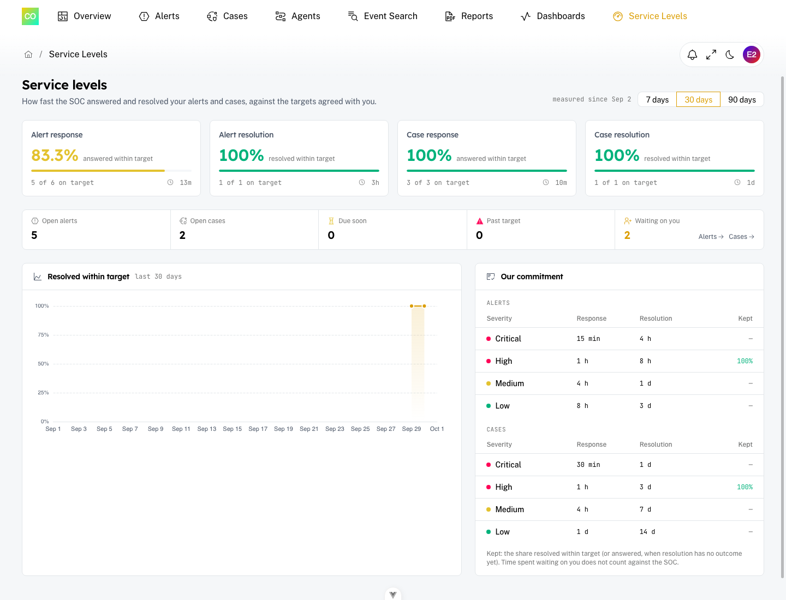

# Customer Portal — Service Levels

**Turn it on:** Customers → (customer) → SLA (admin only)

**In the portal:** Service Levels (top menu)

**Best for:** Admins deciding what a customer sees; account managers showing service quality

The **Service Levels** page shows an end customer the targets agreed with them and how the SOC kept them. It reads the same figures as [SOC Management](./soc-management.md), narrowed to that customer.

---

## It is off until you turn it on

Each customer has its own switch, **off by default**: SLA figures never reach a customer without an operator deciding so. While it is off the menu entry does not appear and the portal reads no SLA data for that customer.

Turning it on changes only what the customer can *read*. SLA clocks run for every customer either way, and targets are set under [SLA policies](./sla-policies.md).

Analysts can see the switch; only admins can change it.

---

## What the customer sees

- **Compliance** for alert response, alert resolution, case response and case resolution, with the change against the previous period and the median times.
- **Open now** — open alerts and cases, how many are due soon or past target, and how many are **waiting on you** (with links to those items).
- **Trend** — the share resolved within target over the period (7, 30 or 90 days).
- **Our commitment** — the targets per severity, whether they count business hours, and how each was kept.

What they never see: analyst names, who handled what, per-analyst figures, other customers, or the SOC's internal workload.

A portal user with several customers sees the customers whose page is on, together (and can narrow them with the portal's customer filter).

---

## "Waiting on you"

When the SOC sets one of the customer's alerts or cases to **Waiting on customer**, the portal shows it as **Waiting on you**, with a banner on the item: *the SOC is waiting on your reply*. Replying with a comment hands the item back to the SOC and restarts its clocks; the time spent waiting is never counted against the SOC.

Customers cannot set this status themselves — it is the SOC's way of asking them for something.

---

## Related pages

- SOC Management: ./soc-management.md
- SLA policies and business hours: ./sla-policies.md
- Customer Portal (branding and settings): ./customer-portal.md
