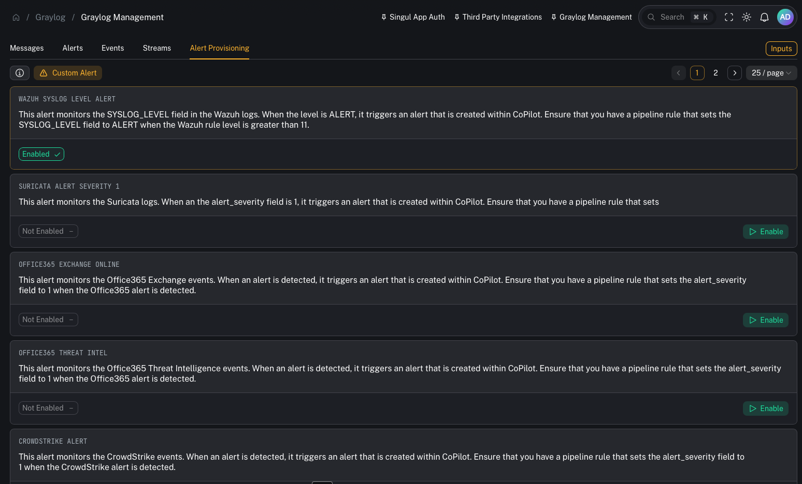
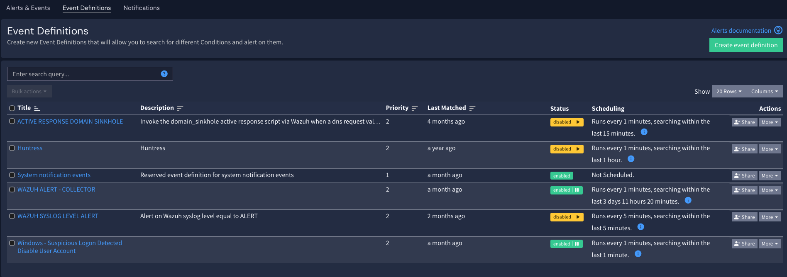
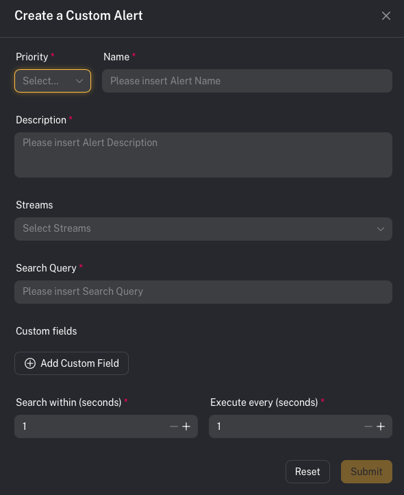

# Graylog management (alerting)

**Menu:** Graylog → Management

This page is for **Admin / Engineer** workflows.

CoPilot uses **Graylog** as the detection and alerting engine. If Graylog isn’t creating event alerts, CoPilot won’t have anything to ingest into **Incident Management → Alerts**.

---

## How CoPilot alerting works (Graylog → gl-events* → CoPilot)

1) Your log metadata is ingested (Wazuh, O365, firewall, third-party, etc.)
2) Graylog evaluates **Event Definitions** (your detection logic)
3) When a condition matches, Graylog creates an **Event/Alert** and writes it to an index (commonly `gl-events*`)
4) CoPilot reads those event alerts and creates/updates alerts in **Incident Management**

---

## Alert Provisioning (pre-built detections)

SOCFortress ships a set of **pre-built alert provisioning items** to help you get alerts flowing quickly.

Examples visible in the lab:
- **WAZUH SYSLOG LEVEL ALERT** — triggers when `SYSLOG_LEVEL = ALERT` (usually set via pipeline when Wazuh rule level is > 11)
- **OFFICE365 EXCHANGE ONLINE** — example O365 alert source
- **OFFICE365 THREAT INTEL** — O365 threat intel alerts
- **CROWDSTRIKE ALERT** — CrowdStrike alerts
- **FORTINET SYSTEM / FORTINET UTM** — FortiGate alerts
- **PALOALTO ALERT** — Palo Alto alerts

> These pre-built items assume you have pipeline rules that normalize key fields (for example: setting an `alert_severity` or equivalent “this is an alert” marker).

---

## Event Definitions (your detection logic)

Event Definitions are where you define:
- the query/conditions
- aggregation/time window
- when an event should fire

Operator impact:
- Better event definitions → higher signal alerts → less noise in CoPilot.

---

## Custom alerts (build your own)

You are not limited to SOCFortress pre-built detections.

If you can ingest metadata into Graylog, you can create an alert off it.

Practical examples:
- Alert on risky admin actions in Office 365
- Alert on firewall activity to known phishing URLs
- Alert on anomalous authentication patterns

---

## Related configuration (ties into Incident Sources)

After Graylog is firing events, you still need CoPilot to map those events into an operator-friendly alert.

Next step:
- Configure **Incident Sources** (field mappings for title/asset/time/context):
  - [Incident sources (Graylog → Alerts)](/user/ui/incident-sources)

---

## Common gotchas

### “I configured a Graylog alert, but CoPilot alerts are missing context”
That’s typically an **Incident Sources mapping** issue: CoPilot needs to know which fields to treat as title, asset name, and context.

### “My detection is firing, but CoPilot shows nothing”
Confirm:
- the Event Definition actually creates events
- events are written to `gl-events*`
- CoPilot can read that index (permissions/connectivity)
