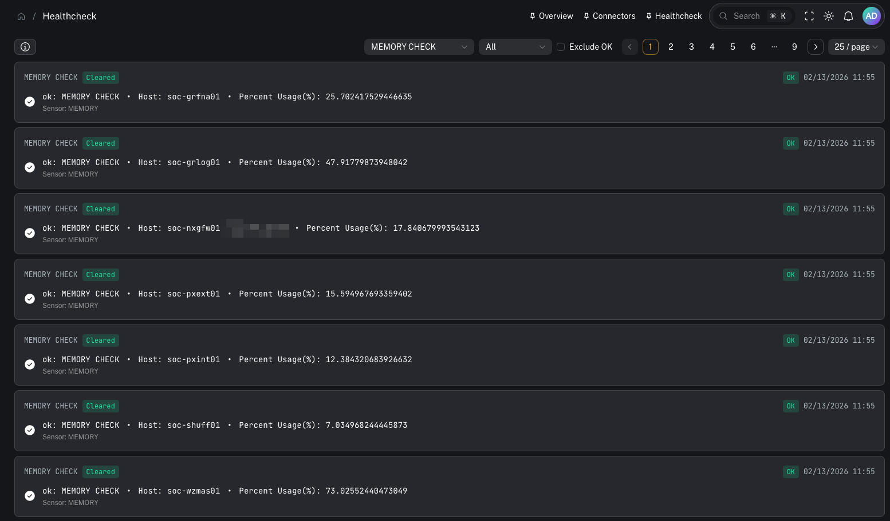
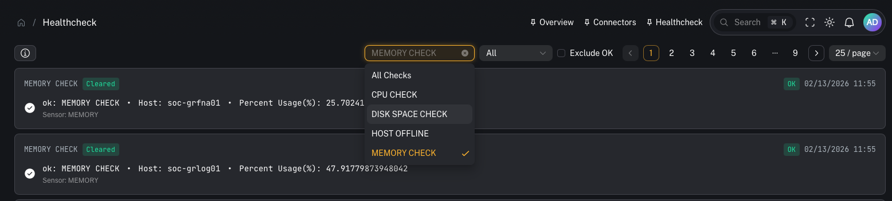
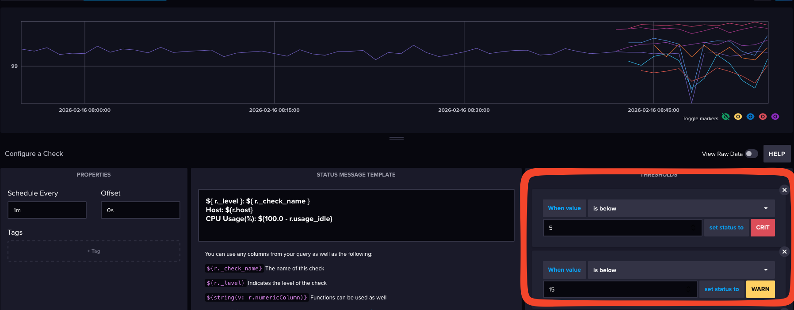

# Healthcheck (InfluxDB + Telegraf)

**Menu:** Healthcheck

**Best for:** Admin / Engineer (primary) + Operator (awareness)

CoPilot’s Healthcheck ties into **InfluxDB** to surface health signals collected by **Telegraf**.

Typical signals include:
- CPU consumption
- memory consumption
- disk space utilization

This is useful for detecting spikes, capacity issues, and “slow burn” failures before they impact your SIEM.

---

## How it works (high level)

1) **Telegraf** runs on endpoints/servers and collects metrics (cpu/mem/disk)
2) Metrics land in **InfluxDB** (CoPilot queries the InfluxDB `_monitoring` bucket)
3) Health checks and thresholds create alert states (ok/info/warn/crit)
4) CoPilot displays the resulting alerts in the Healthcheck UI

---

## What you can do in CoPilot

### Review active alerts

Use this to quickly see:
- what is currently broken / at risk
- which systems are trending toward failure

### Triage by severity

Healthcheck alerts are categorized by severity (for example: **Critical**, **Warning**, **Info**, **Ok**).

---

## What to monitor (recommended)

### CPU
- sustained high CPU on Graylog/Wazuh components can cause ingestion/alerting lag

### Memory
- memory pressure can lead to OOM kills and unstable services

### Disk
- disk thresholds are the most common SIEM failure mode (indexes stop accepting writes)

---

## Practical runbook (when something trips)

1) Identify what triggered (disk vs cpu vs mem)
2) Identify the system/host
3) Decide whether this is:
   - a transient spike
   - a sustained capacity issue
   - a misconfiguration (wrong retention / noisy ingestion)
4) Take action:
   - disk: snapshot/restore + retention tuning + index cleanup
   - cpu/mem: scale resources, tune ingestion, investigate heavy queries

Related pages:
- [Index management (Wazuh Indexer)](/user/ui/indices-management)
- [Snapshot & restore (cold storage)](/user/ui/indices-snapshots)

---

## Advanced: check names and thresholds

Depending on your deployment, Influx may expose many checks.

If you want to standardize what shows up in CoPilot, define consistent Telegraf inputs and consistent alert thresholds.

---

## Common gotchas

### “Healthcheck is empty”
Common causes:
- Telegraf isn’t deployed or isn’t shipping metrics
- InfluxDB connector isn’t configured in CoPilot
- wrong org/bucket configuration (CoPilot expects `_monitoring`)

### “Alerts are noisy”
Tune thresholds to avoid flapping (especially CPU) and focus on sustained conditions.
