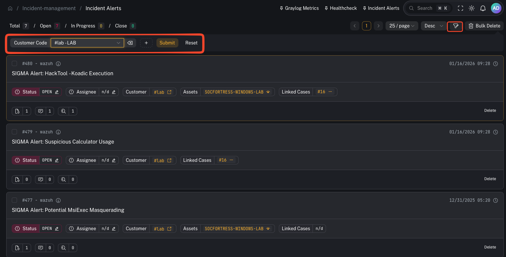
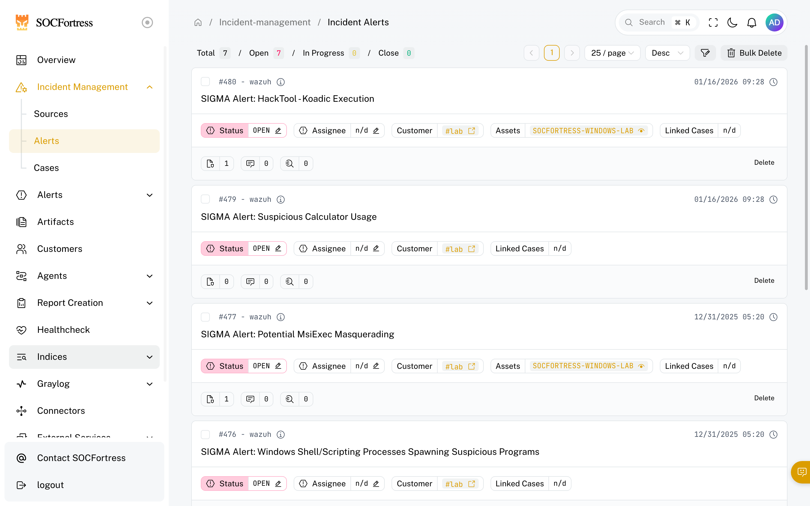
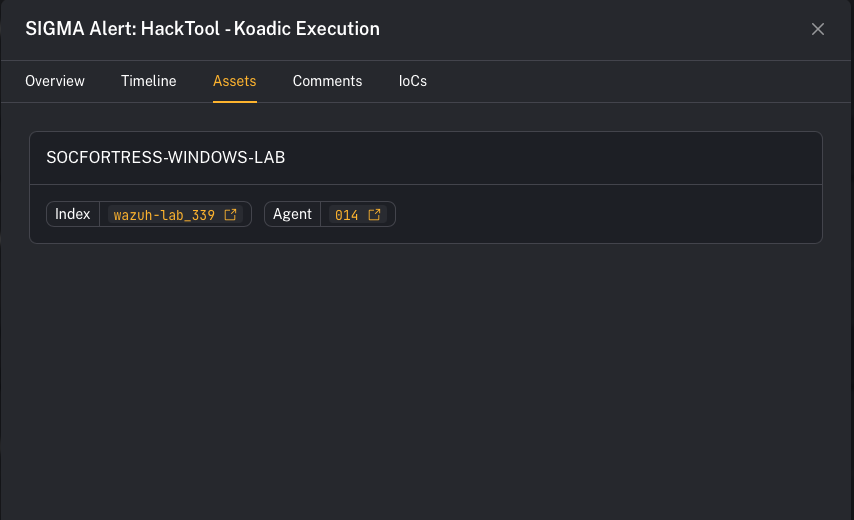
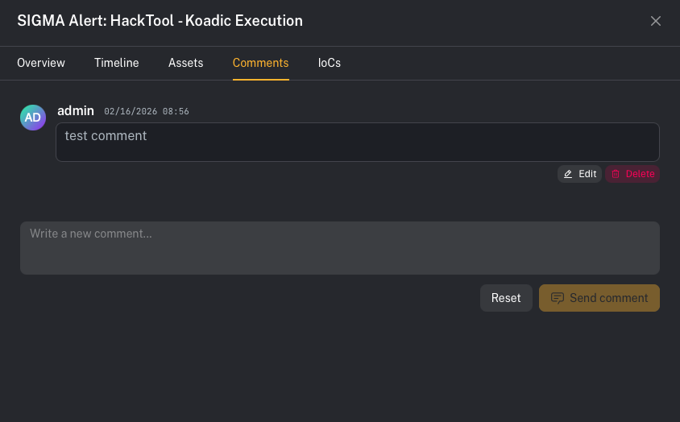
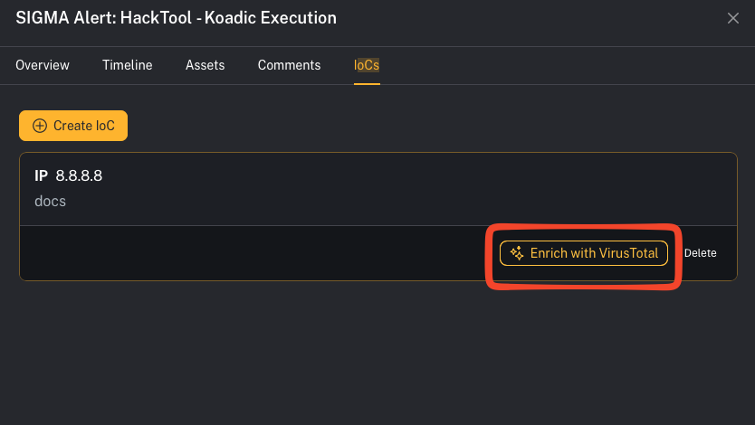
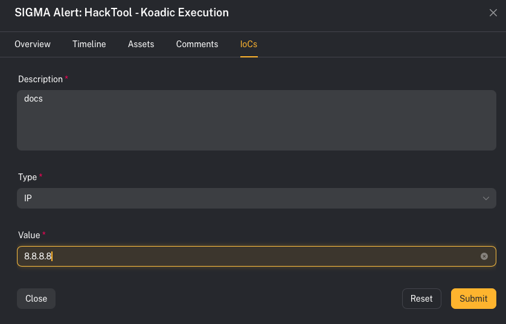

# Incident alerts

**Menu:** Incident Management → Alerts

This is your primary triage queue.

---

## What you’re looking at

The Alerts view is split into two parts:

- **Alerts list** (left): your queue (newest/most relevant alerts)
- **Alert details** (right or modal): the selected alert, with tabs like **Overview** and **Timeline**

Deep link tip: you can open/highlight an alert directly with:

`/incident-management/alerts?alert_id=<id>`

---

## Step 1 — Triage an alert (quick workflow)

1) Open **Incident Management → Alerts**
2) Click an alert in the list to open **details**
3) In **Overview**, confirm:
   - **Customer** (tenant)
   - **Title / Description**
   - **Assets** impacted (an alert can include multiple assets)
   - Any existing **Tags**, **Comments**, and **IOCs**
4) Decide your next action:
   - add a **Comment** (notes + handoff)
   - add an **IOC** (evidence you want tracked)
   - apply **Tags** (triage labels + RBAC visibility)
   - move to a **Case** (if you need investigation tracking)

---

## Step 2 — Filter the queue (find what matters fast)

Use the filter controls to narrow your queue.

### UI callout: Add filter → Customer Code + Tag

1) Click **Add filter**
2) Add **Customer Code**
   - Pick a tenant from the dropdown (shows as `#<code> - <name>`)
3) Add **Tag**
   - The Tag filter is **multi-select**
   - You can type a tag and press **Enter** to add it
4) Click **Submit** to apply

Available filters include:

- **Status** (Open / Closed / In progress)
- **Assigned To** (dropdown)
- **Customer Code** (dropdown)
- **Source** (dropdown)
- **Tag** (multi-select; type + Enter)
- **Title** (text)
- **Asset Name** (text)
- **IoC** (text)

Notes:
- Filters are intended to speed up triage — they don’t bypass security.
- **Customer scoping** and **tag-based visibility** are enforced server-side.

---

## Step 3 — Apply tags (triage + access control)

Tags are used for two things:

1) **Triage / workflow labels** (examples: `needs-validation`, `high-confidence`, `containment`, `false-positive`)
2) **Role-based access control (RBAC)**: some environments restrict alert visibility by tag.

Operator-facing tips:
- If an alert “disappears” from your view, it may be because:
  - you no longer have access to that **customer**, or
  - you don’t have access to one of the alert’s **tags**.

---

## Step 4 — Understand assets on alerts (why one alert can have many)

An alert can be linked to **multiple assets** (hosts/users/entities).

CoPilot also has **dedup/merge** behavior:

- If a *new incoming alert* matches an **existing OPEN alert** for the **same customer** and has the **same title**, CoPilot will **not** create a second alert.
- Instead, it **adds the new asset** to the existing alert.
- A new alert is created when:
  - the previous alert was moved to a **CLOSED** phase for that customer, or
  - the same title appears for a **different customer**.

Why this matters in triage:
- The alert title may look “unchanged,” but the **asset list grows**, which is often your first signal that scope expanded.

---

## Step 5 — Comments and IOCs (collaboration + evidence)

In the alert details pane, use the tabs:
- **Comments** (for notes + handoff)
- **IoCs** (for evidence you want tracked)

### UI callout: Add a comment

1) Open the alert details
2) Click the **Comments** tab
3) Type into **“Write a new comment…”**
4) Click **Send comment**

Tip: use comments for decision logging (“why we think this is benign/malicious”), scope notes, and handoff.

### UI callout: Add an IOC

1) Open the alert details
2) Click the **IoCs** tab
3) Click **Create IoC**
4) Fill out:
   - **Description**
   - **Type** (IP / DOMAIN / HASH / URL)
   - **Value**
5) Click **Submit**

Notes:
- The **Value** field is disabled until you select a **Type**.
- IOCs can be deleted later from the IoCs list.

---

## Timeline (audit trail)

Use the **Timeline** tab to review alert activity over time (updates, notes, linked context).

---

## Common gotchas

### “Why didn’t a new alert get created?”
It was likely merged into an existing OPEN alert (same customer + same title) and the new entity showed up under **Assets**.

### “I can’t delete this alert in bulk”
Bulk delete intentionally skips alerts that are **linked to cases**.

### “Why can’t I see an alert my teammate can see?”
Tag-based RBAC and customer access are enforced server-side. Differences in **tag access** or **customer access** can change visibility.
