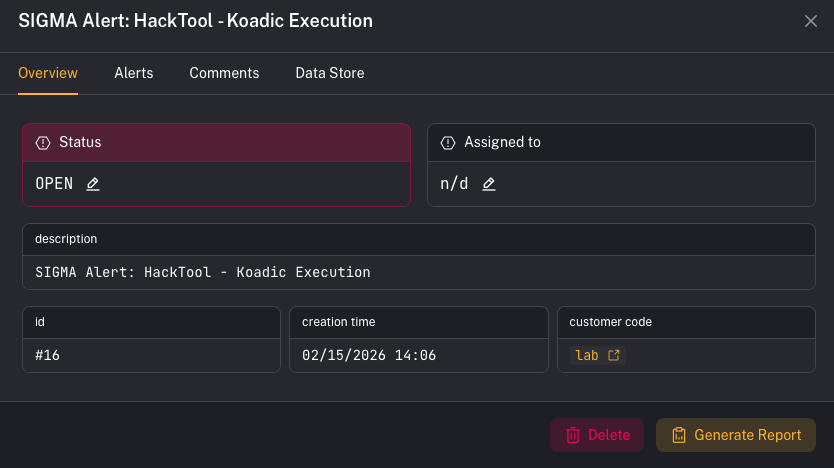
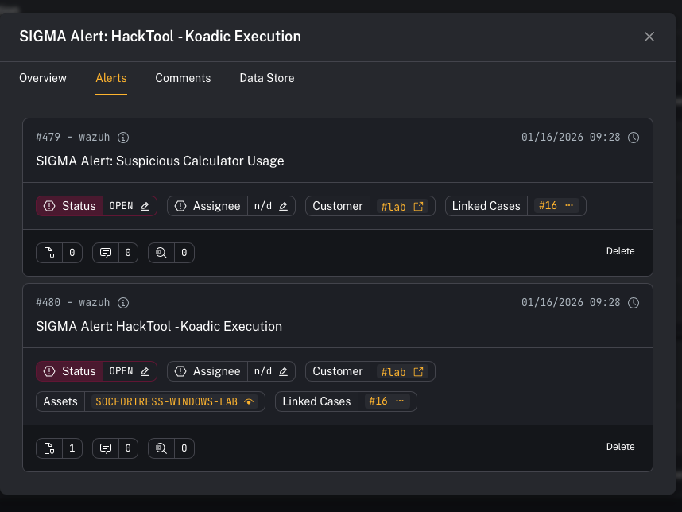
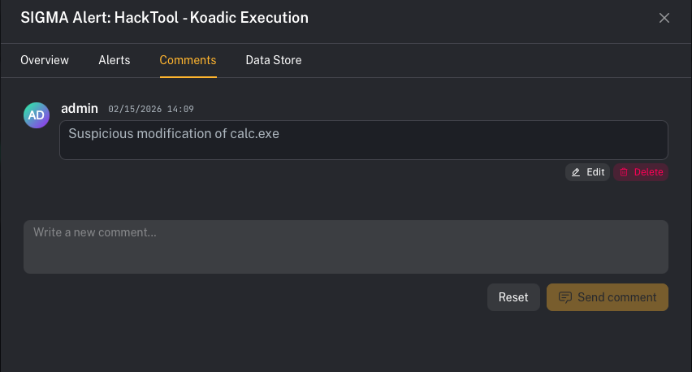
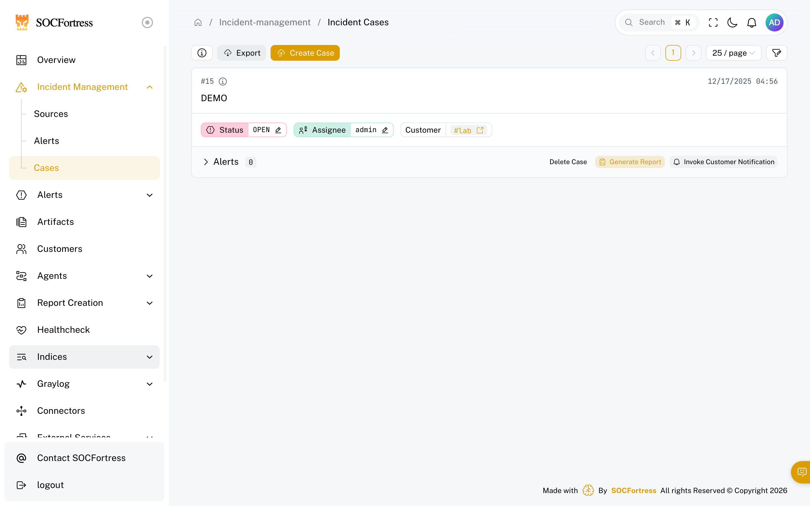
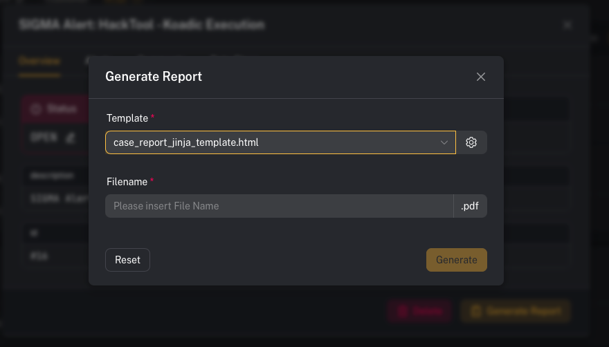

# Incident cases

**Menu:** Incident Management → Cases

Cases are where you **bundle related alerts into one investigation** (example: Wazuh + firewall + third‑party integration alerts) and track the work from triage → resolution.

Deep link tip: you can open/highlight a case directly with:

`/incident-management/cases?case_id=<id>`

---

## What you’re looking at

The Cases view is split into two parts:

- **Cases list** (left): your queue of open/in‑progress/closed cases
- **Case details** (right or modal): the selected case, with tabs like:
  - **Overview**
  - **Alerts** (linked alerts)
  - **Comments**
  - **Data Store**

---

## Step 1 — Create or open a case

1) Open **Incident Management → Cases**
2) Click a case in the list to open **details**
3) Use **Overview** to confirm:
   - case name + description
   - customer (tenant)
   - status + assignee

---

## Step 2 — Link multiple alerts to the same case

A case becomes valuable when it holds *all the signals* for the incident.

Example workflow:
- A **Wazuh** alert fires (endpoint)
- A **firewall** alert fires (network)
- A **third‑party integration** alert fires (cloud / email / EDR)

Link them all to the same case so the case becomes the single place to:
- see the full timeline of signals
- coordinate comments
- generate a consolidated report

### UI callout: Review linked alerts

1) Open the case details
2) Click the **Alerts** tab
3) Confirm all related alerts are listed under this case

> Tip: You can link alerts from the **Alerts** screen as well (operators usually start from an alert, then attach it to an existing case).

---

## Step 3 — Use comments for investigation notes + handoff

1) Open the case details
2) Click **Comments**
3) Add investigation notes, decisions, and handoff context

---

## Step 4 — Use Data Store for supporting material

Use **Data Store** to keep files tied to the case (exports, screenshots, timelines, supporting artifacts).

---

## Step 5 — Generate a case report (Jinja templates)

Cases can generate reports using templates.

### UI callout: Generate Report

1) Open the case details
2) In **Overview**, click **Generate Report**
3) Choose a **Template**
4) Enter a **Filename**
5) Click **Generate**

Template notes:
- Templates are **customizable** and support **Jinja** templating.
- Different template types may generate different outputs (for example: a `.docx` template vs an `.html` template used to generate a PDF).

---

## Common gotchas

### “Why can’t I find all alerts for this incident in one place?”
Make sure you link each relevant alert (endpoint + network + third‑party) into the same case via the **Alerts** tab.

### “My report template isn’t available in the dropdown”
Report templates are managed in the template manager (your environment may restrict who can upload/manage templates).
