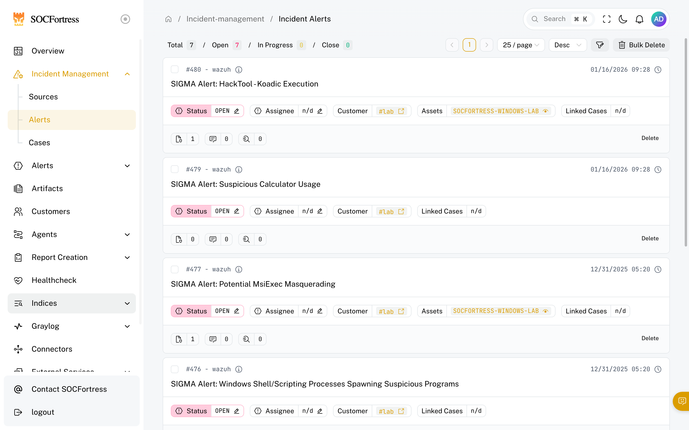

# Incident Management

**Menu:** Incident Management

**Best for:** SOC operators / analysts

Incident Management is where analysts spend most of their time.

## Sub-pages

- **Sources**: define/organize alert sources
- **Alerts**: triage queue
- **Cases**: investigation lifecycle
- **Case Templates**: reusable investigation playbooks (admin / analyst) — see [Case templates](incident-case-templates.md)

