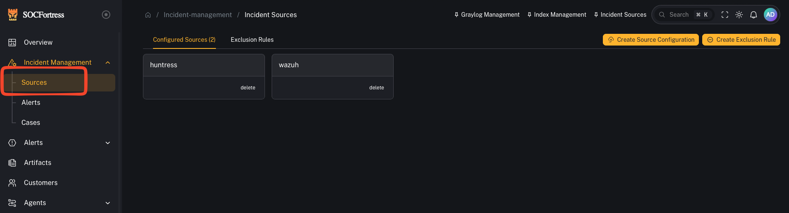
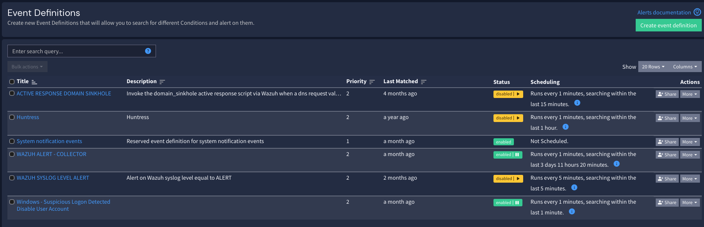
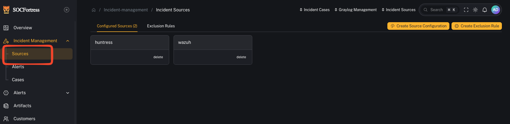
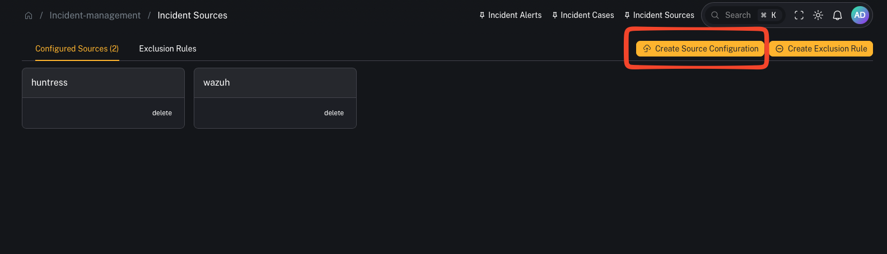
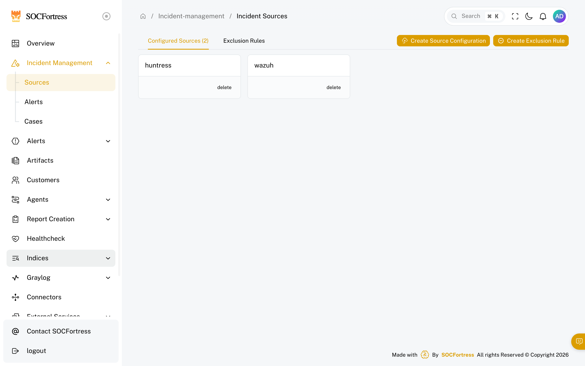

# Incident sources (Graylog → Alerts)

**Menu:** Incident Management → Sources

**Best for:** Admin / Engineer

Incident Sources define how CoPilot **turns Graylog event alerts into CoPilot Incident Alerts**.

In practice, Sources answer:
- *Which logs/index patterns are eligible to create alerts?*
- *How do we group alerts by “source” (Wazuh vs O365 vs Mimecast vs …)?*
- *Which fields become the alert title, asset, timestamp, and context we see in CoPilot?*

---

## How alerting works (mental model)

CoPilot uses **Graylog** to do the detection logic and searching.

High level:

1) Graylog evaluates **Event Definitions** (your detection logic)
2) When an event fires, Graylog writes an alert into an index (commonly `gl-events*`)
3) CoPilot reads those event alerts and **creates/updates** alerts inside **Incident Management → Alerts**

---

## What a “Source” means in CoPilot

A **Source** is essentially an **alert category**.

Examples:
- **Wazuh** (endpoint alerts)
- **Office 365**
- **Mimecast**
- **CrowdStrike**
- **Firewall / Syslog**

This keeps your triage queue clean and helps you group alerts by where they came from.

---

## Step 1 — Create a source

1) Open **Incident Management → Sources**
2) Click to **add** a new source
3) Give it a name you’ll use consistently (example: `wazuh`, `office365`, `mimecast`)

---

## Step 2 — Choose the index pattern(s) for this source

You’ll select which index patterns/log sources are relevant for this alert source.

Important:
- This does **not** mean “alerts can only be created from this one index.”
- It’s defining what data CoPilot can use as **alert context** when it builds the alert record.

---

## Step 3 — Map the fields CoPilot needs (the important part)

A source defines which fields CoPilot should use when it creates an alert.

### Alert title field
This becomes the alert’s **title** in CoPilot.

Example (Wazuh):
- rule description is often the best title field (it explains *why* it fired).

### Asset name field
This controls which entity becomes the **Asset** on the alert (and is key for dedup/merging behavior).

Example (Wazuh):
- agent name is commonly used as the asset name.

### Time field
This controls which timestamp CoPilot uses for alert ordering/timelines.

Tip:
- Pick the most reliable timestamp for the detection record you’re using.

### Context fields
These are the fields you want visible inside the alert details.

Important distinction:
- Context fields are **not** the detection logic.
- Detection logic stays in **Graylog Event Definitions**.
- Context fields define what metadata CoPilot stores/displays when the alert fires.

---

## Step 4 — Validate end-to-end

1) In Graylog, confirm your **Event Definition** is firing (test with a known event)
2) Confirm Graylog writes events into `gl-events*`
3) In CoPilot, confirm a new alert appears under **Incident Management → Alerts** with:
   - correct **Source**
   - correct **Title**
   - correct **Asset**
   - useful **Context** fields

---

## Common gotchas

### “Graylog is alerting, but CoPilot shows nothing”
Usually one of:
- the event alerts aren’t being written where CoPilot expects (index / permissions)
- source field mappings don’t match the fields in the event payload

### “Alerts are grouped wrong / mixed between integrations”
Create separate Sources (Wazuh vs O365 vs Mimecast vs firewall) and ensure your Graylog event definitions populate the fields needed to classify them.

### “Alerts don’t have enough metadata”
Add more **context fields** to the source mapping so CoPilot can store/display the details operators need.
