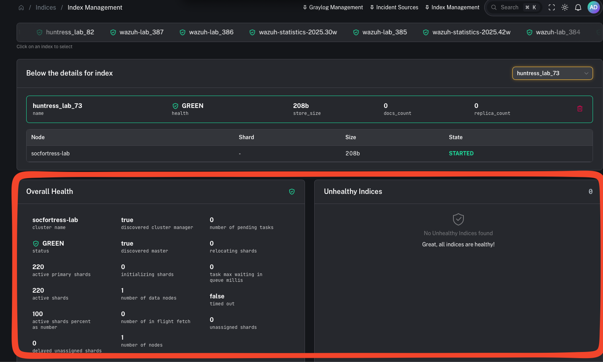
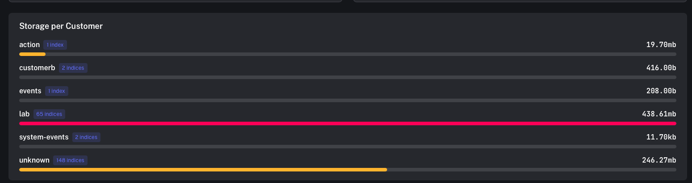
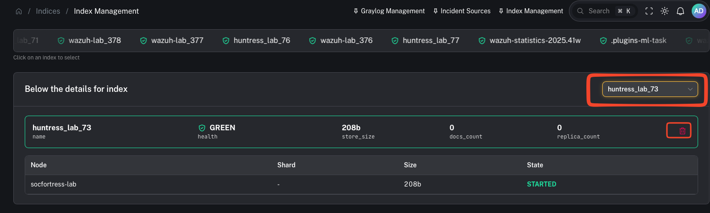

# Index management (Wazuh Indexer)

**Menu:** Indices → Index Management

**Best for:** Admin / Engineer

Index Management gives you an operational view of your **Wazuh Indexer** storage and index health.

This matters because the indexer is where your SIEM data lives — if storage or index health degrades, search/alerting and investigations degrade with it.

---

## What you can do here

- Check overall **indexer health** (high-level “are we OK?” signal)
- See **storage usage by customer** (who is consuming the most disk)
- Identify large/noisy indexes
- Delete indexes when appropriate (careful: destructive)

---

## Step 1 — Review overall health

Use this as your first stop when you see:
- searches slowing down
- ingestion backpressure
- dashboards timing out
- alerting gaps

---

## Step 2 — Review storage by customer (who is using the disk?)

This view helps you answer:
- Which customers have the highest log volume?
- Which customer is driving storage growth this week?
- Do we need to tune ingestion/noise upstream?

Practical actions:
- confirm high-volume customers match expectations (endpoint count, integrations)
- tune noisy sources (drop/suppress earlier in the pipeline)
- adjust retention strategy

---

## Step 3 — Delete indexes (only when you mean it)

Deleting an index is destructive.

Use cases:
- removing test/lab data
- cleaning up misconfigured pipelines that created junk indexes
- emergency disk recovery (prefer snapshots + retention tuning first)

---

## Related: cold storage via Snapshot & Restore

If you need to free up space without losing historical logs, use:
- [Snapshot & Restore](/user/ui/indices-snapshots)
