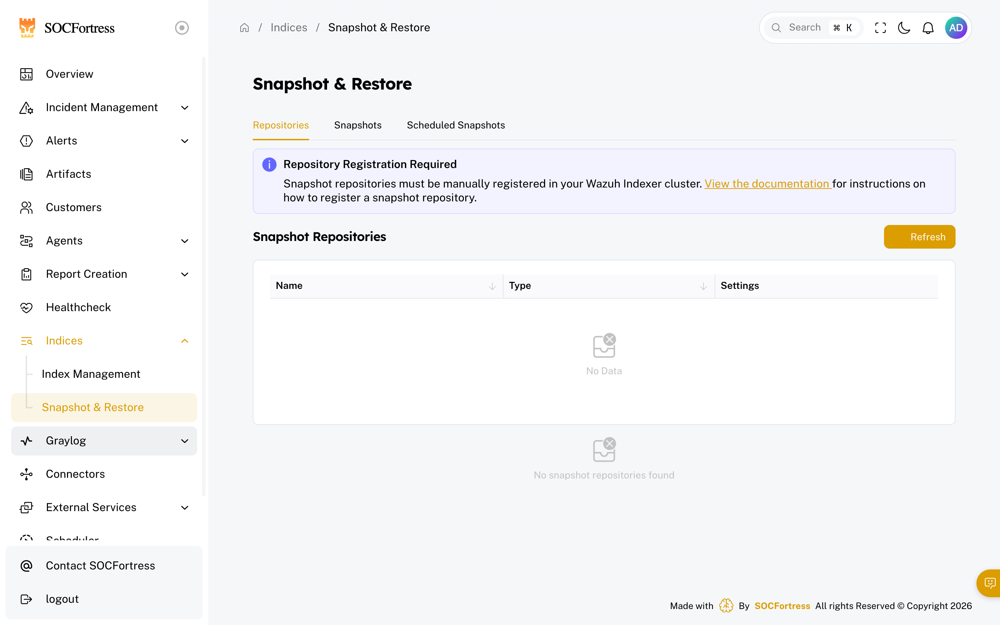
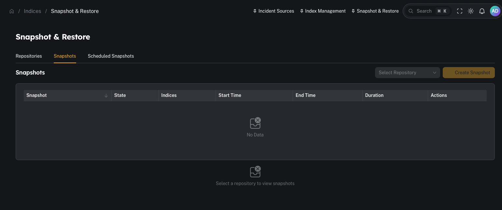
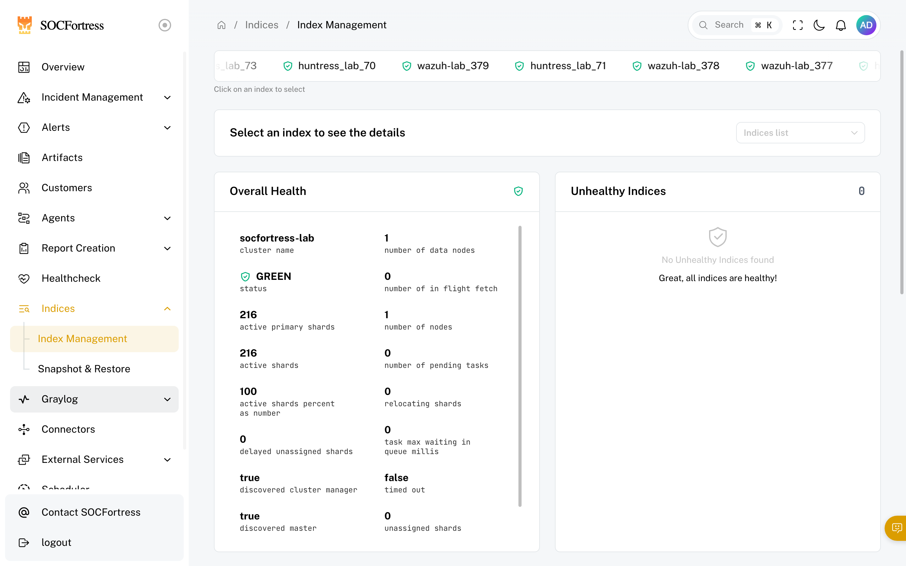

# Snapshot & restore (cold storage)

**Menu:** Indices → Snapshot & Restore

**Best for:** Admin / Engineer

Snapshots let you **offload older indexes into cold storage** (snapshot repositories) so you can make room for new events while still keeping the ability to restore history later.

---

## When to use snapshots

Use snapshots when you need to:
- reduce disk usage on the indexer
- keep long-term historical logs without keeping them “hot”
- preserve data before major maintenance/changes

---

## Repository registration is required

CoPilot can manage snapshots, but the snapshot **repository must exist and be registered** in the Wazuh Indexer cluster first.

In the UI you’ll see this warning if none exist:

> “Snapshot repositories must be manually registered in your Wazuh Indexer cluster …”

---

## Step 1 — Verify repositories

1) Open **Indices → Snapshot & Restore**
2) Click **Repositories**
3) Confirm at least one repository exists and is healthy

---

## Step 2 — Create a snapshot

1) Go to **Snapshots**
2) Choose the repository
3) Select the index/index pattern(s) to snapshot
4) Run the snapshot

---

## Step 3 — Restore a snapshot (when you need old data)

Restoring brings historical data back so you can:
- investigate an incident with older timelines
- run retro-hunts
- rebuild context for cases

---

## Step 4 — Schedule snapshots (automation)

If you regularly offload older logs, scheduled snapshots help keep disk usage stable.

### Schedule window (time-of-day + day interval)

By default a snapshot schedule is evaluated every 15 minutes — and if there are new indices to snapshot, it fires immediately. That can mean snapshot operations hit the Wazuh Indexer during business hours, when the cluster is busiest.

Each schedule has four optional fields that pin execution to a maintenance window:

| Field | Type | Purpose |
|---|---|---|
| **Scheduled Hour** | `0–23` (or empty) | Hour of day the schedule is allowed to run. Empty = any hour (legacy behavior — runs every poll). |
| **Scheduled Minute** | `0–59` (or empty) | Minute of hour. Pairs with Scheduled Hour to form a **15-minute window** starting at this minute. Empty = any minute in the chosen hour. Disabled until Scheduled Hour is set. |
| **Interval (Days)** | `≥ 1`, default `1` | Minimum days between executions. `1` = at most once per day. `7` = at most once per 7 days. |
| **Timezone** | IANA name, default `UTC` | Used to evaluate Scheduled Hour/Minute. Examples: `UTC`, `America/Chicago`, `Europe/London`. DST is handled automatically. |

When the current time is outside the window, the schedule's **Last Execution** column shows a `DEFERRED` tag and **no Wazuh Indexer API calls are made** — there's effectively zero cluster load on deferred polls. The next poll inside the window picks up where it left off, and the existing "no new indices = SKIPPED" deduplication still applies.

#### Example — daily at 02:00 UTC

| Field | Value |
|---|---|
| Scheduled Hour | `2` |
| Scheduled Minute | `0` |
| Interval (Days) | `1` |
| Timezone | `UTC` |

Result: between 02:00 and 02:14 UTC each day, the schedule fires (assuming new indices exist). All other polls are deferred.

#### Example — weekly on Sunday at 01:00 US Central

CoPilot does **not** currently expose an explicit "day of week" field. To pin a schedule to Sundays:

| Field | Value |
|---|---|
| Scheduled Hour | `1` |
| Scheduled Minute | `0` |
| Interval (Days) | `7` |
| Timezone | `America/Chicago` |

> `America/Chicago` correctly handles US Central time year-round — CST in winter (UTC-6) and CDT in summer (UTC-5).

The first execution will land on whichever day is naturally hit first inside the 01:00 hour Central. Once that first run completes, **`Interval (Days) = 7` keeps the schedule anchored to that same weekday for every subsequent run**.

To force the anchor onto a Sunday specifically:

1. Create the schedule with the values above.
2. Wait for the first run (or manually trigger one) on a Sunday between 01:00 and 01:14 Central.
3. From that point on, the schedule will only fire on Sundays.

Alternatively, an admin with database access can manually set `last_execution_time` on the schedule row to the most recent Sunday at 01:00 Central before enabling the schedule — that anchors the 7-day cadence onto Sundays from the start.

#### Backward compatibility

Schedules created before this feature was introduced — and any new schedule where Scheduled Hour is left empty — keep their original behavior: they run on every 15-minute poll and rely solely on the "new indices needed" check.

---

## Common gotchas

### “No snapshot repositories found”
A repository must be registered in the Wazuh Indexer cluster before snapshots can run.

### “Snapshots succeed but disk is still full”
Snapshots don’t automatically delete hot indexes. You still need a retention plan:
- delete old indexes (with intent)
- reduce ingestion volume
- tune retention windows
