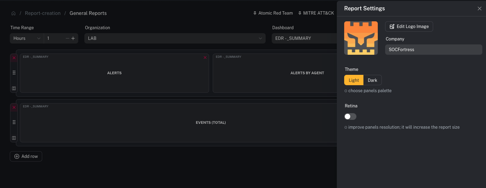
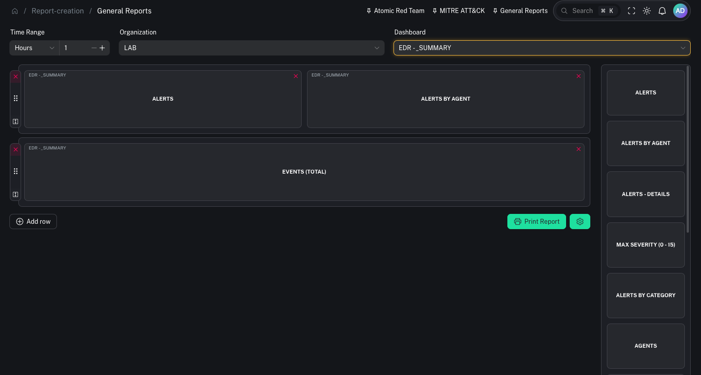

# General reports (Grafana → PDF)

**Menu:** Report Creation → General Reports

General reports generate a PDF by taking snapshots of selected **Grafana dashboard panels**.

---

## What you need

- A Grafana org + dashboard you can access
- The panels you want to include

---

## Step 1 — Pick dashboard + time range

1) Open **Report Creation → General Reports**
2) Select the **Organization**
3) Select the **Dashboard**
4) Choose a **time range** (ex: `24h`, `7d`, `30d`)

---

## Step 2 — Select panels to include

1) Pick the panels you want in the report
2) Arrange/confirm the selection

---

## Step 3 — Generate the PDF

When you generate the report, CoPilot will:
- create secure iframe links for the selected panels
- capture panel images
- assemble a PDF

Operator tips:
- Keep reports focused: pick 6–12 panels rather than trying to include everything.
- Use consistent time ranges so reports are comparable week-to-week.

---

## Common gotchas

### “This only works on desktop”
General report generation is desktop-oriented (panel selection/layout).

### “Panels are blank / missing data”
Usually a Grafana permissions or time range issue.
