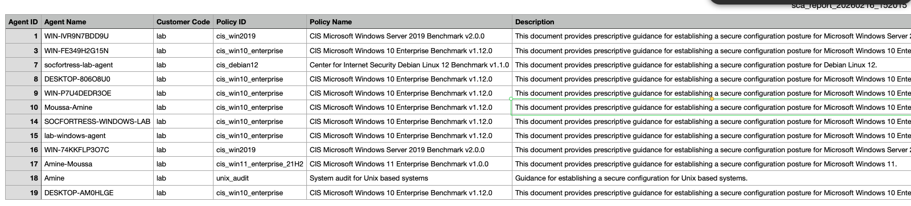
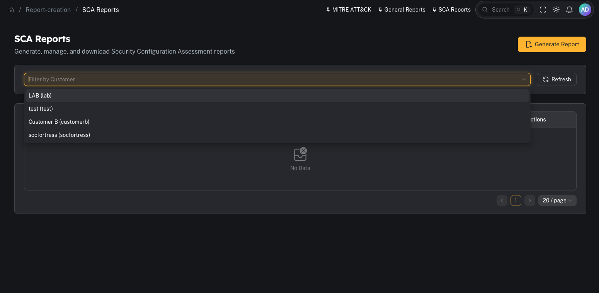
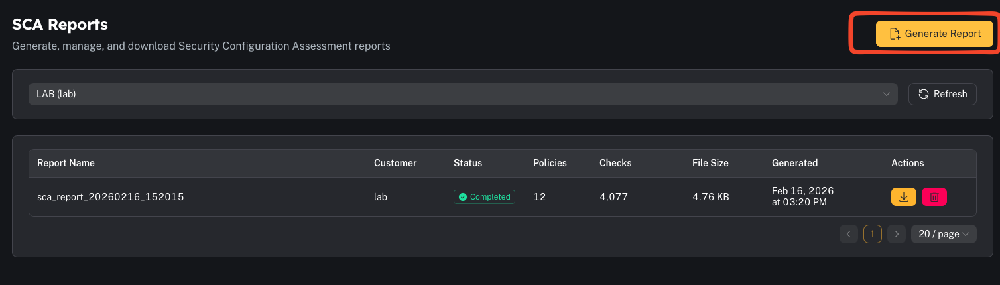

# SCA reports (Wazuh)

**Menu:** Report Creation → SCA Reports

SCA (Security Configuration Assessment) reports pull from the **Wazuh SCA module**, which evaluates endpoints against hardening/compliance policies.

Wazuh SCA model (simplified):
- agents scan against SCA **policies** (rules/checks)
- results are tracked per check (pass/fail/not applicable)
- agents send diffs/summary to the manager to reduce noise

---

## What you can do

- Review SCA posture across a customer (policy score, failing checks)
- Generate a CSV report for auditing and remediation planning

---

## Step 1 — Review SCA overview

Common operator filters:
- Customer
- Agent/host
- Policy id/name
- Minimum/maximum score

---

## Step 2 — Generate and download

When you generate an SCA report, CoPilot produces a **CSV** containing policy results.

Operator tips:
- Treat SCA as a “secure baseline drift” signal.
- Use policy-based grouping (CIS/NIST mappings) for audit discussions.

---

## Common gotchas

### “No SCA data found”
Common causes:
- SCA is not enabled on the agents
- policies are not deployed
- the agents haven’t scanned yet (or haven’t checked in)

### “Why did results change?”
SCA alerts are typically emitted on **status change** between scans (pass↔fail↔n/a) rather than spamming every scan.
