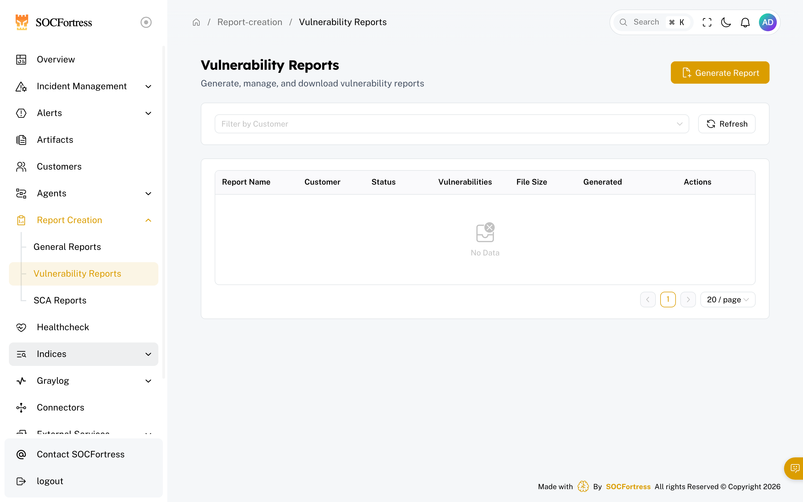
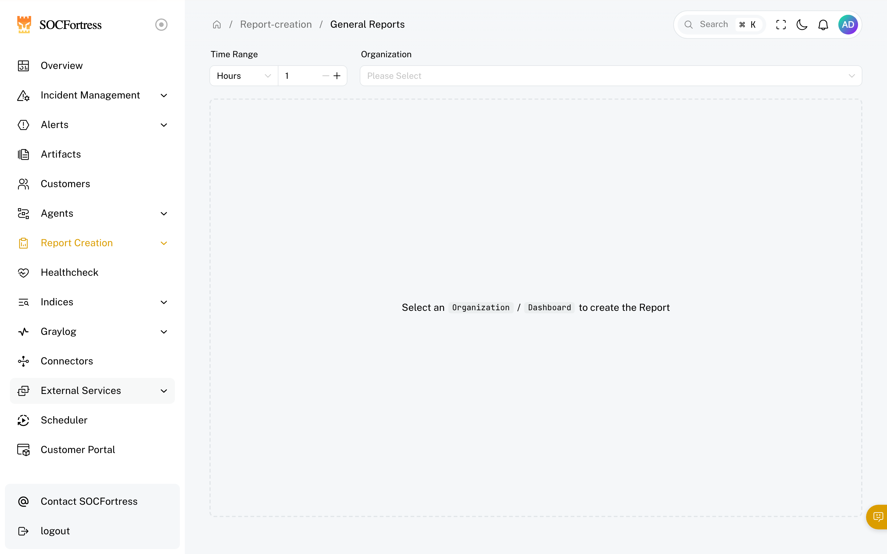
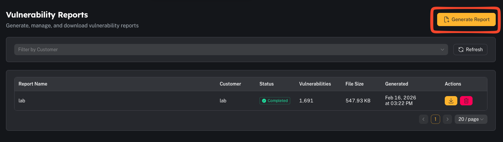

# Vulnerability reports (Wazuh)

**Menu:** Report Creation → Vulnerability Reports

Vulnerability reports pull data from the **Wazuh Vulnerability Detection** module.

Wazuh’s model (simplified):
- agents collect software inventory via **Syscollector**
- the manager correlates inventory with CTI feeds and flags CVEs
- results are indexed and queryable (inventory + alerts)

---

## What you can generate

- A vulnerability report for a specific **customer/tenant**
- Filtered views by severity, agent, package, CVE, etc. (depending on UI/options)

---

## Step 1 — Filter what you want to report on

Common operator filters:
- Customer
- Severity (Critical/High/Medium/Low)
- Agent/host
- Specific CVE (`CVE-…`)

---

## Step 2 — Generate and download

When you generate a report, CoPilot produces a **CSV** and stores it for download.

Operator tips:
- Use “Critical + High” first for remediation prioritization.
- If you’re generating very large reports, prefer background generation if available.

---

## Common gotchas

### “The report is empty”
Common causes:
- the Wazuh vulnerability module isn’t enabled or isn’t indexing status
- the customer has no Syscollector inventory data
- filters are too narrow

### “Why do vulnerabilities exist even if we patched?”
Wazuh correlates inventory versions + hotfix data (Windows) against CVE ranges. Inventory and patch state need to be current.
