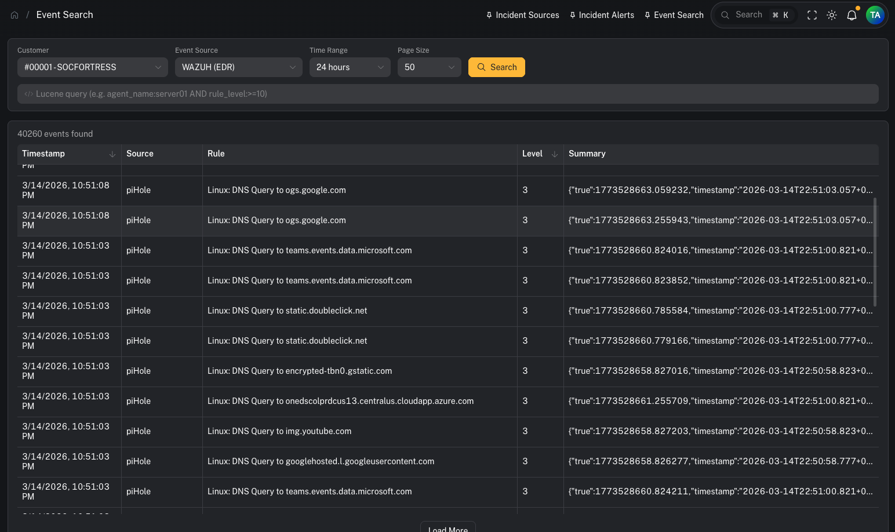
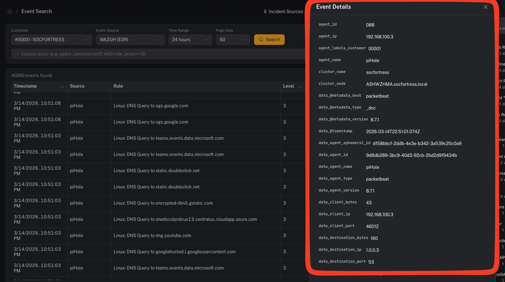

# Event Search

**Menu:** SIEM → Event Search

**Best for:** Operators + Analysts

Event Search lets you query **raw SIEM events** directly from the Wazuh Indexer across any configured [Event Source](/user/ui/siem-event-sources). Use it for investigation, threat hunting, and validating detection coverage.

---

## Prerequisites

Before using Event Search, a customer must have at least one **Event Source** configured. If no Event Sources exist for the selected customer, a warning banner will appear with instructions.

See: [Event Sources](/user/ui/siem-event-sources) for setup instructions.

---

## Step 1 — Select a customer and event source

Use the filter bar at the top to select:

1. **Customer** — the tenant whose data you want to query
2. **Event Source** — the specific data source (e.g. Wazuh EDR, Office 365 Logs)
3. **Time Range** — how far back to search (1 hour to 30 days)
4. **Page Size** — number of results per page (25–250)

---

## Step 2 — Write a Lucene query (optional)

The search bar supports full **Lucene query syntax**. If left empty, all events in the time range are returned.

**Example queries:**

| Query | What it finds |
|---|---|
| `agent_name:web-server-01` | Events from a specific agent |
| `rule_level:>=10` | High-severity alerts (level 10+) |
| `agent_name:dc01 AND rule_level:>=8` | Combined filters |
| `rule_description:"brute force"` | Phrase match in rule description |
| `NOT agent_name:test-*` | Exclude test agents |

### Field name autocomplete

As you type a field name, an autocomplete dropdown appears showing matching field names from the selected index. Press **Tab** to accept a suggestion.

---

## Step 3 — Review results

Results appear in a sortable table with these columns:

| Column | Description |
|---|---|
| **Timestamp** | When the event occurred |
| **Source** | The agent or source that generated the event |
| **Rule** | The rule description or ID that triggered |
| **Level** | Severity level (color-coded: red ≥12, orange ≥8, blue ≥4) |
| **Summary** | The full log message or event data |

Click any row to open the **Event Detail** drawer.

### Loading more results

If more events exist beyond the current page, a **Load More** button appears below the table. Click it to fetch the next batch of results.

---

## Step 4 — Inspect event details

Clicking a row opens a side drawer showing **every field** in the event, sorted alphabetically.

### Filter from the detail drawer

Hover over any field to reveal two action buttons:

- **Filter (+)** — adds `field:"value"` to your query and re-runs the search
- **Exclude (−)** — adds `NOT field:"value"` and re-runs the search

This lets you quickly drill down or exclude noise without manually typing queries.

---

## Deep-linking from Incident Management

When viewing an alert asset in **Incident Management → Alerts**, the `alert_linked` field includes a **"View in Event Search"** link. Clicking it opens Event Search in a new tab with the customer, default EDR source, and Lucene query pre-populated to find the specific alert.

---

## Tips

- **Broad first, then narrow:** Start with a wide time range and no query, then use the detail drawer's filter buttons to progressively refine.
- **Use wildcards sparingly:** Lucene supports `*` and `?` wildcards in values, but leading wildcards (e.g. `*server`) are expensive — avoid them on large indexes.
- **Check the time range:** If you're not finding expected events, try expanding the time range — the default is 24 hours.
- **Bookmark queries:** The URL contains query parameters (`customer_code`, `source_name`, `query`), so you can bookmark or share a specific search.

---

## Related pages

- [Event Sources](/user/ui/siem-event-sources) — configure which indexes to search per customer
- [SIEM Alerts](/user/ui/alerts-siem) — high-level alert summaries from Graylog
- [MITRE ATT&CK](/user/ui/alerts-mitre) — technique-centric alert view
- [Incident Alerts](/user/ui/incident-alerts) — the analyst investigation queue
