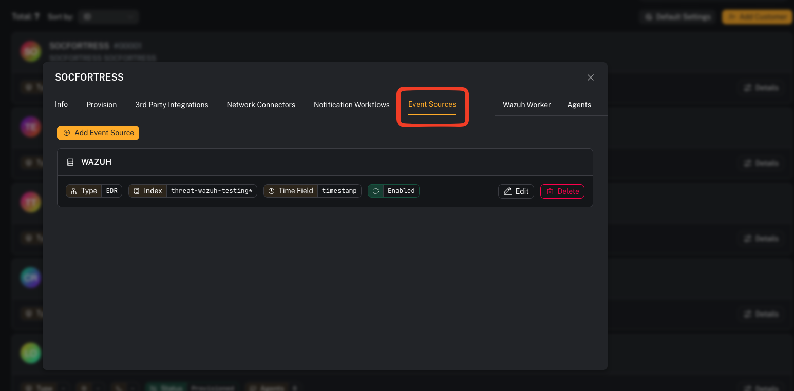

# Event Sources

**Menu:** Customers → (select customer) → Event Sources tab

**Best for:** Admin / Engineer

Event Sources tell CoPilot which **index patterns** to query for each customer when using [Event Search](/user/ui/siem-event-search). You must configure at least one Event Source per customer before Event Search will work for that customer.

---

## What is an Event Source?

An Event Source defines:

| Field | Description |
|---|---|
| **Name** | A human-readable label (e.g. "Wazuh EDR", "Office 365 Logs") |
| **Index Pattern** | The Wazuh Indexer index pattern to query (e.g. `wazuh-CUSTOMER_CODE_*`) |
| **Event Type** | Category — one of: EDR, EPP, Cloud Integration, Network Security |
| **Time Field** | The field used for time-based filtering (typically `timestamp`) |
| **Enabled** | Whether this source is available for selection in Event Search |

---

## Step 1 — Navigate to the customer's Event Sources

1. Go to **Customers** in the sidebar
2. Select the customer you want to configure
3. Click the **Event Sources** tab

---

## Step 2 — Create a new Event Source

Click the **+ Add** button and fill in the form:

**Tips:**
- The **Index Pattern** field auto-suggests patterns based on the customer code (e.g. `wazuh-lab_*`)
- For Wazuh/EDR data, use `timestamp` as the Time Field
- Set **Event Type** to match the data type so analysts can filter sources by category

---

## Step 3 — Edit or delete an Event Source

Each Event Source card shows its configuration at a glance. Use the action buttons to:
- **Edit** — update the index pattern, time field, or toggle enabled/disabled
- **Delete** — permanently remove the source (admin only)

---

## Gotchas

- A customer **must have at least one enabled Event Source** before Event Search will work for them. If none exist, a warning banner will appear on the Event Search page.
- Disabling an Event Source hides it from the Event Search dropdown but does not delete it.
- The index pattern must match actual indices in your Wazuh Indexer — double-check the pattern if searches return zero results.

---

## Next step

Once an Event Source is configured, head to [Event Search](/user/ui/siem-event-search) to start querying events.
