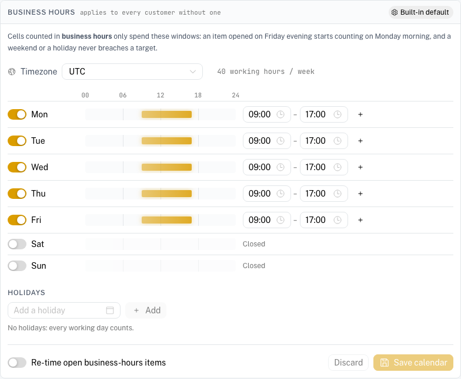

# SLA policies and business hours

**Menu:** SOC Management → SLA policies

**Best for:** Admin (analysts can read, only admins can change)

An SLA policy is the promise the SOC makes: for each **severity** of **alert** and **case**, how soon it will be **acknowledged** (respond within) and **resolved** (resolve within). [SOC Management](./soc-management.md) measures every item against it.

---

## Where targets come from

Each cell (entity × severity) resolves to the first of:

1. **the customer's override**, if the customer has one for that cell;
2. **the global policy**, if it sets that cell;
3. **the built-in default**.

| Severity | Alert: respond / resolve | Case: respond / resolve |
|---|---|---|
| Critical | 15 min / 4 h | 30 min / 1 d |
| High | 1 h / 8 h | 1 h / 3 d |
| Medium | 4 h / 1 d | 4 h / 7 d |
| Low | 8 h / 3 d | 1 d / 14 d |
| Informational | no target | no target |

Leaving a target empty means **no promise** for that clock: those items are not counted in compliance at all, rather than counted as met.

A case's severity is the one set on the case, or — when none is set — the most severe of its linked alerts.

---

## Editing a policy

1. Pick the scope on the left: **Global policy**, or a customer (customers with overrides are marked).
2. For each cell, switch it to **Custom** / **Override** to give it its own targets; switched off, it follows the next scope out and shows the value it inherits.
3. Enter **Respond within** and **Resolve within** in minutes, hours or days.
4. Choose **Counted in**: **24/7** or **Business hours** (see below).
5. **Save**.

**Follow global** removes every override of a customer at once.

### What happens to items already open

Each item keeps the targets it **opened with** — a policy change is a promise about new work. Turn on **Apply to items still open** when saving to re-time the open ones too. Even then, a clock that is already met or breached never changes: an acknowledgement that was on time stays on time.

---

## Business hours

A cell counted in **business hours** only spends working time. *4 business hours* for an alert opened on Friday at 16:00 runs one hour on Friday and three on Monday morning; a weekend or a holiday never breaches it.

The calendar is edited below the policy matrix, for the scope you have selected:

- **Timezone** — the calendar's own (e.g. `Europe/Rome`). Working windows are local time, and daylight-saving changes are handled.
- **Working week** — each day open or closed, with one or more windows (a lunch break is two windows). The strip shows the day at a glance.
- **Holidays** — closed days on top of the week.

Which calendar applies:

1. the **customer's calendar**, if it has one;
2. otherwise the **global calendar**;
3. otherwise the built-in default, **Monday–Friday 09:00–17:00 UTC** — set the real one before relying on business hours.

The label in the corner always says which one you are looking at. **Follow global** removes a customer's own calendar. **Re-time open business-hours items** applies a calendar change to open items, with the same rule as above: only clocks still running move.

Built-in cells are 24/7. Nothing changes for existing customers until you switch a cell to business hours.

---

## Waiting on the customer

Setting an alert or case to **Waiting on customer** stops both its clocks; the time spent waiting is added back to its due times and left out of its time to resolve. On a business-hours cell the wait is measured in working time too, so a weekend spent waiting extends a business-hours target by nothing.

The customer's reply in the portal hands the item back to the SOC (*In progress*) and restarts the clocks. A case set to waiting takes its open alerts with it, and brings them back when it resumes.

---

## Related pages

- SOC Management: ./soc-management.md
- Notifications (SLA at risk / breached): ./notifications.md
- Customer Portal — Service Levels: ./customer-portal-service-levels.md
