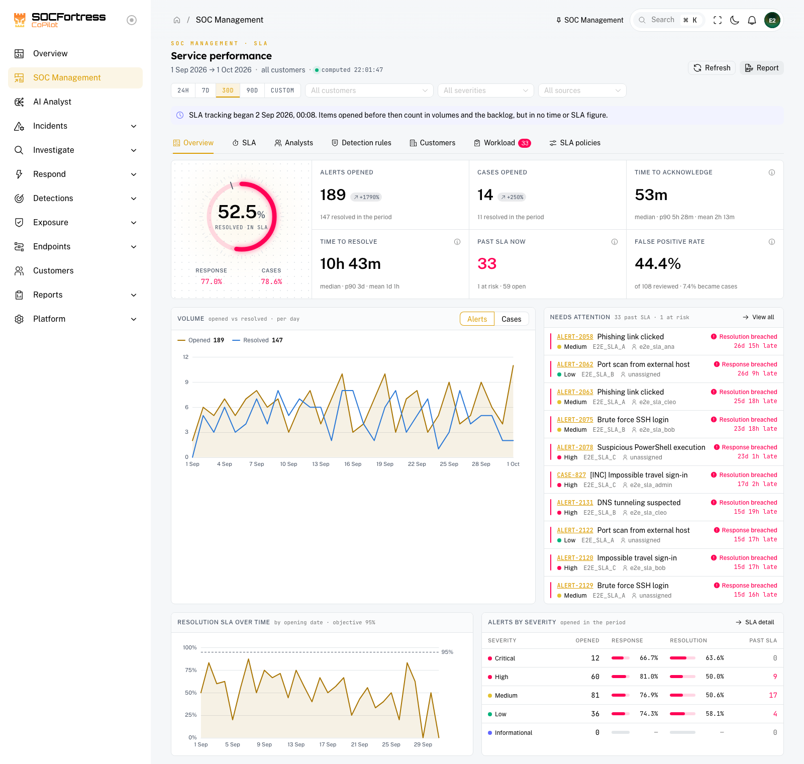
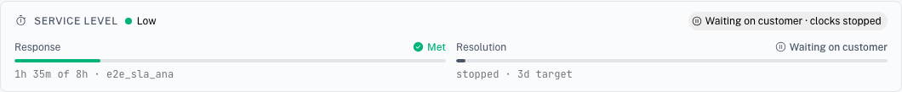
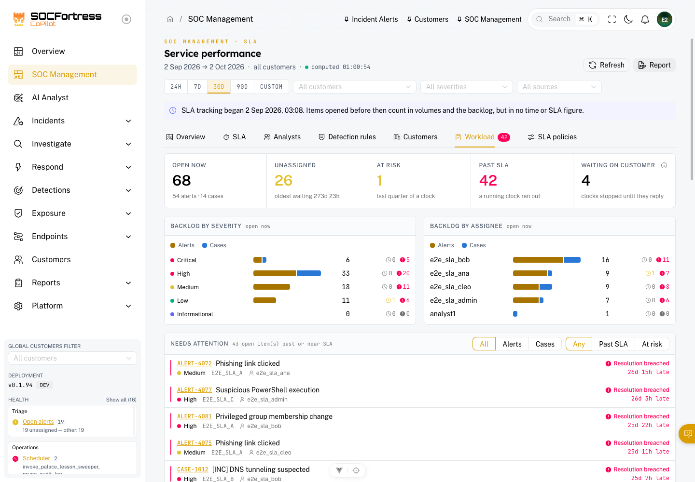

# SOC Management

**Menu:** SOC Management (top of the sidebar)

**Best for:** SOC managers, team leads, admins — and analysts, for their own figures

SOC Management answers the questions a SOC is judged on: **how fast did we respond, how fast did we resolve, did we keep the promise we made to each customer, and what is about to slip?** Every figure comes from the alerts and cases in Incident Management — there is nothing to feed it by hand.

The targets it measures against are the **SLA policies** — see [SLA policies and business hours](./sla-policies.md).

---

## The two clocks

Every alert and case runs two clocks from the moment it reaches CoPilot:

| Clock | Stops when | Counts as a response |
|---|---|---|
| **Response** (time to acknowledge) | The SOC first acts on the item | assigning it, changing its status, commenting, setting a verdict, escalating, linking it to a case, changing a case's severity |
| **Resolution** (time to resolve) | The item is closed | — |

Two rules that matter when reading the numbers:

- **Only the SOC acknowledges.** A customer commenting on their own alert in the portal, or automation writing to it, does not stop the response clock — the clock measures *your* response. A customer *closing* an item does resolve it; those closures are reported apart.
- **Waiting on the customer stops both clocks.** Set an alert or case to **Waiting on customer** when you need something from them (a confirmation, a log, a decision). The clocks stop until the item moves on — the customer's reply in the portal hands it back to you automatically (it returns to *In progress*). The wait is never counted against the SOC.

Every alert and case page shows its own clocks in the **Service level** panel: time used against the target, who stopped each clock, and whether it is waiting on the customer.

---

## How the figures are computed

- **Compliance = met ÷ (met + breached).** Items still running have no outcome yet and are left out of both sides. "No outcome yet" shows as **—**, never as 0% or 100%.
- **Times are medians.** One bulk close of old noise can move an average by days; the median does not. The mean and the 90th percentile are shown next to it for the tail.
- **"Past SLA now"** counts open items whose clock has run out *and is still running*. A late acknowledgement stays a breach in the compliance figures, but it is not something to chase anymore.
- **Every tab is one snapshot.** All tabs, the attention list and the PDF report are computed together, so they never disagree.
- **Items opened before SLA tracking began** (the upgrade that introduced this page) count in volumes and in the backlog, but in no time or compliance figure — a banner says from when tracking runs.

---

## Filters

At the top: the **period** (24 hours, 7, 30 or 90 days, or a custom range), **customers**, **severities** and **sources**. Filters and the current tab live in the URL, so a link you share opens the same view.

You only ever see what your access allows: customer assignments and tag-based access apply exactly as in the alert and case lists.

---

## Tabs

| Tab | What it shows |
|---|---|
| **Overview** | The headline: SLA compliance, volumes opened/resolved with the change against the previous period, median times, past SLA now, false-positive rate, the volume trend and the items that need attention |
| **SLA** | Response and resolution compliance per severity, target against actual, and resolution compliance over time |
| **Analysts** | Per analyst: items acknowledged and resolved, their times, SLA kept, current load. **Admins see every analyst; an analyst sees only their own row.** |
| **Detection rules** | The rules producing alerts, how many became cases, how many were false positives — noisy rules are flagged for tuning |
| **Customers** | Per customer: volumes, backlog, past SLA, times and compliance |
| **Workload** | The live backlog: open, unassigned (and since when), at risk, past SLA, **waiting on customer**, by severity and by assignee, plus the full attention list |
| **SLA policies** | The targets and business-hours calendars — see [SLA policies and business hours](./sla-policies.md) |

**At risk** means a running clock has entered the last quarter of its window. On a business-hours target that quarter is measured in working time, so a target due on Monday morning is not "at risk" all weekend.

---

## The PDF report

**Report** (top right) downloads the SOC operations report for the current filters: the same figures as the page, ready to share with management.

SLA figures can also go to a customer, in two ways the SOC controls:

- the **Service Level Performance** section of a customer incident report (*Customers → (customer) → Reporting*, option **SLA performance**) — never with analyst names;
- the customer's own **Service Levels** page in the Customer Portal, switched on per customer — see [Customer Portal — Service Levels](./customer-portal-service-levels.md).

---

## Being told before it is too late

Two notification triggers, **An alert or case SLA is at risk** and **An alert or case SLA is breached**, send a message once per clock to an internal route (Teams, email to the assignee, a webhook…). See [Notifications](./notifications.md).

---

## Related pages

- SLA policies and business hours: ./sla-policies.md
- Incident Alerts: ./incident-alerts.md
- Incident Cases: ./incident-cases.md
- Notifications: ./notifications.md
- Customer Portal — Service Levels: ./customer-portal-service-levels.md
